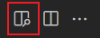
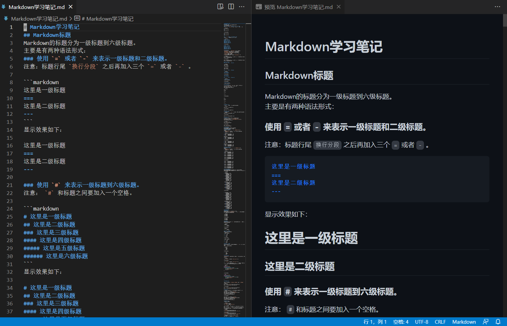
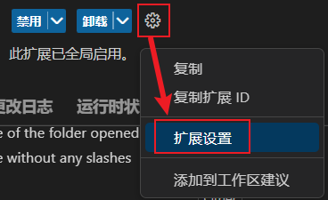
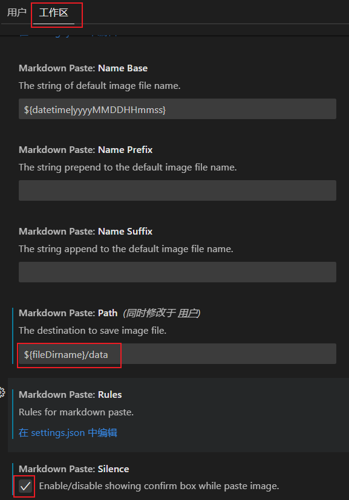
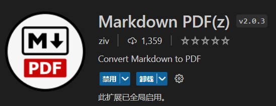
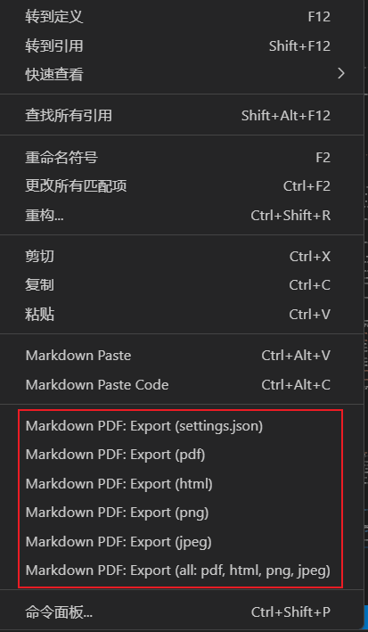
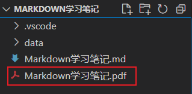
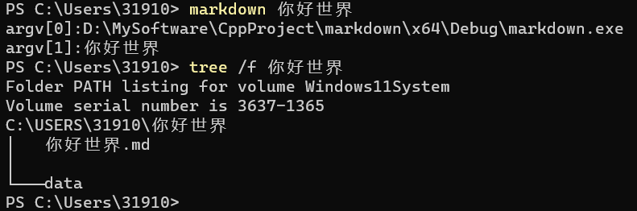

# Markdown学习笔记  
## Markdown标题
Markdown的标题分为一级标题到六级标题。  
主要是有两种语法形式：  

### 使用 `=` 或者 `-` 来表示一级标题和二级标题。
注意：标题行尾 `换行分段` 之后再加入三个 `=` 或者 `-` 。  
  
```markdown
这里是一级标题
===
这里是二级标题
---
```
显示效果如下：

这里是一级标题  
===  
这里是二级标题  
---  
  
### 使用 `#` 来表示一级标题到六级标题。
注意： `#` 和标题之间要加入一个空格。  

```markdown
# 这里是一级标题  
## 这里是二级标题  
### 这里是三级标题  
#### 这里是四级标题  
##### 这里是五级标题  
###### 这里是六级标题  
```
显示效果如下：  
  
# 这里是一级标题  
## 这里是二级标题  
### 这里是三级标题  
#### 这里是四级标题  
##### 这里是五级标题  
###### 这里是六级标题  
  
## Markdown段落
`Markdown的段落` 和 `MSWord的段落` 不是一个意思。  
`MsWord的段落` 指的是有换行的几行文字的组合。  
`Markdown的段落` 指的是无换行的一整行文字。  
使用 `\{space}\{space}\{enter}` 表示换行分段。  
`\{space}` 指的是空格键。  
`\{enter}` 指的是回车键。  
换行之后的内容表示的是一个新的 `Markdown的段落` 。  

```markdown
这是一个Markdown段落。行尾使用两个空格和一个回车表示换行分段。  
这是另一个Markdown段落。
```
显示效果如下：  

这是一个Markdown段落。行尾使用两个空格和一个回车表示换行分段。  
这是另一个Markdown段落。
  
## Markdown字体

### 使用 `*` 或者 `_` 表示斜体  
   
```markdown
*这是斜体字*  
_这也是斜体字_  
```  
显示效果如下：  

*这是斜体字*  
_这也是斜体字_  
  
### 使用 `*` 或者 `_` 表示粗体  
   
```markdown
**这是粗体字**  
__这也是粗体字__    
```  
显示效果如下：  

**这是粗体字**  
__这也是粗体字__    
  
### 使用 `*` 或者 `_` 表示粗斜体  
   
```markdown
***这是粗斜体字***  
___这也是粗斜体字___    
```  
显示效果如下：  

***这是粗斜体字***  
___这也是粗斜体字___    
  
## Markdown分隔线
在一行中用三个以上的 `*` 、`-` 、`_` 来建立一个分隔线。  
也可以在 `*` 、`-` 、`_` 中间插入空格。  
但是行内不能有其他东西。  
下面每种写法都可以建立分隔线：  

```markdown  
***  
* * *  
******  
---
- - - 
------  
___
_ _ _  
______  
```  
显示效果如下：  
  

***  
* * *  
******  
---
- - - 
------  
___
_ _ _  
______  
  
## Markdown删除线
使用两个 `~` 把要添加删除线的文字包裹起来。  

```markdown   
这里是~~添加删除线的文字~~。  
```  
显示效果如下：  
  
这里是~~添加删除线的文字~~。  
  
## Markdown下划线
使用Html的 `<u>` 和 `</u>` 标签把要添加下划线的文字包裹起来。 
```markdown  
这里是<u>添加下划线的文字</u>。  
```  
显示效果如下：  
  
这里是<u>添加下划线的文字</u>。  
  
## Markdown列表  
Markdown列表分为有序列表和无序列表。  
Markdown列表之间可以进行嵌套。  

### Markdown有序列表  
有序列表使用数字并加上 `.` 作为 `列表项的标记` 。  
注意：  
1. `列表项的标记` 后面要添加一个空格，然后再填写内容。  
2. 列表之间使用空行来隔开。  

```markdown  
1. 这是第一个无序列表的第一项  
2. 这是第一个无序列表的第二项  
3. 这是第一个无序列表的第三项  

列表的分隔行    
1. 这是第二个无序列表的第一项  
2. 这是第二个无序列表的第二项  
3. 这是第二个无序列表的第三项  
```  
显示效果如下：  
  
1. 这是第一个无序列表的第一项  
2. 这是第一个无序列表的第二项  
3. 这是第一个无序列表的第三项  

列表的分隔行    
1. 这是第二个无序列表的第一项  
2. 这是第二个无序列表的第二项  
3. 这是第二个无序列表的第三项  

### Markdown无序列表  
无序列表使用 `*` 、`+` 、`-` 作为 `列表项的标记` 。  
注意：  
1. `列表项的标记` 后面要添加一个空格，然后再填写内容。  
2. 列表之间使用空行来隔开。  

```markdown  
* 这是第一个无序列表的第一项  
* 这是第一个无序列表的第二项  
* 这是第一个无序列表的第三项  
  
+ 这是第二个无序列表的第一项  
+ 这是第二个无序列表的第二项  
+ 这是第二个无序列表的第三项  
  
- 这是第三个无序列表的第一项  
- 这是第三个无序列表的第二项  
- 这是第三个无序列表的第三项  
```  
显示效果如下：  

* 这是第一个无序列表的第一项  
* 这是第一个无序列表的第二项  
* 这是第一个无序列表的第三项  
  
+ 这是第二个无序列表的第一项  
+ 这是第二个无序列表的第二项  
+ 这是第二个无序列表的第三项  
  
- 这是第三个无序列表的第一项  
- 这是第三个无序列表的第二项  
- 这是第三个无序列表的第三项  
  
### Markdown列表嵌套  
Markdown列表的列表项里的内容可以是另一个Markdown列表。  
列表嵌套只需在子列表中的列表项前面添加两个或四个空格，保持缩进格式一致即可。  

```markdown  
1. 有序列表的第一项：
    - 无序列表的第一项
    - 无序列表的第二项
    - 无序列表的第三项
2. 有序列表的第二项：
    - 无序列表的第一项
    - 无序列表的第二项
    - 无序列表的第三项
3. 有序列表的第三项：
    - 无序列表的第一项
    - 无序列表的第二项
    - 无序列表的第三项

- 无序列表的第一项：
    1. 有序列表的第一项
    2. 有序列表的第二项
    3. 有序列表的第三项
- 无序列表的第二项：
    1. 有序列表的第一项
    2. 有序列表的第二项
    3. 有序列表的第三项
- 无序列表的第三项：
    1. 有序列表的第一项
    2. 有序列表的第二项
    3. 有序列表的第三项
```  
显示效果如下：  

1. 有序列表的第一项：
    - 无序列表的第一项
    - 无序列表的第二项
    - 无序列表的第三项
2. 有序列表的第二项：
    - 无序列表的第一项
    - 无序列表的第二项
    - 无序列表的第三项
3. 有序列表的第三项：
    - 无序列表的第一项
    - 无序列表的第二项
    - 无序列表的第三项

- 无序列表的第一项：
    1. 有序列表的第一项
    2. 有序列表的第二项
    3. 有序列表的第三项
- 无序列表的第二项：
    1. 有序列表的第一项
    2. 有序列表的第二项
    3. 有序列表的第三项
- 无序列表的第三项：
    1. 有序列表的第一项
    2. 有序列表的第二项
    3. 有序列表的第三项
  
## Markdown区块  

### 区块概念
区块故名思意，类似一个特殊的缩进格式。  
Markdown区块是在 `Markdown的段落` 开头使用 `>` ，然后后面紧跟一个空格符号，然后书写区块内容。

```markdown  
> 这是区块1  
> 这是区块2  
> 这是区块3
```  
显示效果如下：  
  
> 这是区块1  
> 这是区块2  
> 这是区块3
  
### 区块嵌套  
另外区块是可以嵌套的，一个 `>` 符号是最外层，两个 `>` 符号是第一层嵌套，以此类推： 

```markdown  
> 最外层  
> > 第一层嵌套  
> > > 第二层嵌套  
```  
显示效果如下：  
  
> 最外层  
> > 第一层嵌套  
> > > 第二层嵌套  
  
### 区块中使用列表  
区块中使用列表实例如下：  
```markdown
> 区块中使用列表  
> 1. 第一项  
> 2. 第二项  
> + 第一项  
> + 第二项  
> + 第三项  
```  
显示效果如下：  
  
> 区块中使用列表  
> 1. 第一项  
> 2. 第二项  
> + 第一项  
> + 第二项  
> + 第三项  
  
### 列表中使用区块  
如果要在列表项目内放进区块，那么就需要在 `>` 前添加四个空格的缩进。  
列表中使用区块实例如下：

```markdown  
* 第一项  
    > 区块一  
    > 区块二  
* 第二项  
```  
显示效果如下：  
  
* 第一项  
    > 区块一  
    > 区块二  
* 第二项  
  
## Markdown代码  
`Markdown的段落` 上的文字可以用反引号( \` )把它包起，表示一个代码片段。  

```markdown  
使用 `printf()` 函数打印 `"hello world"` 。    
```  
显示效果如下：  
  
使用 `printf()` 函数打印 `"hello world"` 。    
  
用 ` ``` ` 包裹一段代码，并在第一个 ` ``` ` 后面指定一种编程语言类型(也可以什么都不写，代表不指定编程语言类型)。  

```markdown  
```cpp      
#include<iostream>  
using namespace std;  
int main(int argc,char** argv){  
    std::cout << "hello world" << std::endl;  
    std::system("pause");  
    return 0;  
}       
```
` ``` `  

显示效果如下：  
  
```cpp      
#include<iostream>  
using namespace std;  
int main(int argc,char** argv){  
    std::cout << "hello world" << std::endl;  
    std::system("pause");  
    return 0;  
}  
```     
  
## Markdown链接  
  
链接使用方法如下： `[链接名称](链接地址)` 或者 `<链接地址>`  
例如：
```markdown
这是一个链接 [菜鸟教程](https://www.runoob.com)  
这也是一个链接 <https://www.runoob.com>  
```  
显示结果如下：  
  
这是一个链接 [菜鸟教程](https://www.runoob.com)  
这也是一个链接 <https://www.runoob.com>  
  
### 高级链接  
我们可以通过变量来设置一个链接，变量赋值在文档末尾进行：  
```markdown  
这个链接用 1 作为网址变量 [Google][1]   
这个链接用 runoob 作为网址变量 [Runoob][runoob]    
然后在文档的结尾为变量赋值（网址）  
[1]: http://www.google.com/  
[runoob]: http://www.runoob.com/  
```
显示结果如下：
  
这个链接用 1 作为网址变量 [Google][1]   
这个链接用 runoob 作为网址变量 [Runoob][runoob]    
然后在文档的结尾为变量赋值（网址）  

 [1]]: http://www.google.com/  

 [runoob]]: http://www.runoob.com/  
  
## Markdown图片  
图片语法格式如下：    

```markdown  
  
  
```  
开头一个感叹号 `!` 。   
接着一个方括号 `[]` ，里面写图片加载失败后的说明性文字(可选项)。  
接着一个普通括号 `()` ，里面放上图片的本地路径/网址地址(必选项)，最后还可以用引号 `""` 包住填写图片的标题(可选项)。  
使用实例：  
```markdown  
  
  
```  
显示效果如下：  
  
  
  
当然，你也可以像网址那样对图片网址使用变量:
```markdown
这个链接用 1 作为网址变量 [这是一个网址][1].  
然后在文档的结尾为变量赋值(网址) 
[1]: http://static.runoob.com/images/runoob-logo.png  
```  
显示效果如下：  

这个链接用 1 作为网址变量 [这是一个网址][1].  
然后在文档的结尾为变量赋值(网址) 

 [1]]: http://static.runoob.com/images/runoob-logo.png  
  
Markdown 还没有办法指定图片的高度与宽度，如果你需要的话，你可以使用普通的 `` 标签。
```markdown
  
```  
显示效果如下：  

  
   
## Markdown表格  
Markdown制作表格使用 `|`来分隔不同的单元格。  
使用 `-` (数量一个以上)来分隔表头和其他行。 
语法格式如下:  

```markdown  
|  表头   | 表头  |  
|  ----  | ----  |  
| 单元格  | 单元格 |  
| 单元格  | 单元格 |  
```
显示效果如下：  
  
|  表头   | 表头  |  
|  ----  | ----  |  
| 单元格  | 单元格 |  
| 单元格  | 单元格 |  
  
可以设置表格中单元格的对齐方式：  
`-:`  设置内容和标题栏居右对齐。  
`:-`  设置内容和标题栏居左对齐。  
`:-:` 设置内容和标题栏居中对齐。  
实例如下：  

```markdown    
| 左对齐 | 右对齐 | 居中对齐 |  
| :-----| ----: | :----: |  
| 单元格 | 单元格 | 单元格 |  
| 单元格 | 单元格 | 单元格 |  
```  
显示效果如下：  
  
| 左对齐 | 右对齐 | 居中对齐 |  
| :-----| ----: | :----: |  
| 单元格 | 单元格 | 单元格 |  
| 单元格 | 单元格 | 单元格 |  
  
## Markdown段首空格  
 `Markdonw的段落`段首使用了空格键 `\{space}` ，在进行渲染时会舍弃段首的空格，从而造成段落显示缩进错误。  
为了解决这一个问题，可以使用 `html` 的空格标签项来表示空格键。  
 `html` 总共定义了三种空格标签项。  

 `&nbsp;` ：这是我们使用最多的空格，也就是按下space键产生的空格。  
 在 `html` 中，如果你用空格键产生此空格，空格是不会累加的(只算1个)。  
 要使用 `html` 实体表示才可累加。该空格占据宽度受字体影响明显而强烈。  
 在 `inline-block` 布局中会搞些小破坏，在两端对齐布局中又是不可少的元素。  

 `&ensp;`：此空格有个相当稳健的特性，就是其占据的宽度正好是1/2个中文宽度，而且基本上不受字体影响。  

 `&emsp;` ：此空格也有个相当稳健的特性，就是其占据的宽度正好是1个中文宽度，而且基本上不受字体影响。  

 ```markdown  
这是没有缩进的状态。  
&emsp;&emsp;这是第一段。  
&emsp;&emsp;这是第二段。  
 ```  
显示效果如下：  
  
这是没有缩进的状态。  
&emsp;&emsp;这是第一段。  
&emsp;&emsp;这是第二段。  
  
## Markdown相关的VSCode插件

### VSCode 自带的侧边栏显示Markdown渲染效果   
VSCode不需要安装任何插件，就支持渲染显示Markdown文件。  
在Markdown文件标签页的右上角有一个按钮。  
  
左键单击选中就会发现在右侧出现了一个侧边栏窗口，窗口里面就是Markdown文件渲染后的显示效果。  
  
  
### Markdown Paste实现 `ctrl+alt+v` 粘贴方式插入剪贴板图片  
插件名称：Markdown Paste  
插件图标：  
   

插件设置：  
   
  
上面的设置的意思：
1. 将剪贴板的图片自动保存到当前文件夹下的data文件夹里。  
2. 使用 `ctrl+alt+v` 粘贴插入剪贴板图片的时候不显示提示框。  
  
### Markdonw PDF(z)实现markdown文件转换为pdf等多种文件格式  
插件名称：Markdown PDF(z)  
插件图标：  
  
插件使用：  
在md文件标签页里面随便找一个地方右键单击，会显示如下菜单栏。  
  
左键单击选中要转换到的格式，稍微等一会儿，就会在当前文件夹下转换生成对应格式的文件，生成的文件的文件名和原先的markdown文件同名。  
  
  
## 编程实现终端使用 `markdown` 命令新建Markdown目录结构    
Markdown目录结构指的是
  
```  
Markdown文件名/  
    |__ data/  
    |__ Markdown文件名.md  
```   
新建一个Cpp项目名为 `markdown` ，项目的C++语言标准设置为C++17。  
然后添加一个 `main.cpp` 文件到项目中，文件内容如下：  
   
```cpp  
#include<iostream>
#include<string>
#include<filesystem>
#include<fstream>
// 检查文件/文件名命名是否有效
static bool checkDirFileName(std::string const& name) {
    // 1 名称不得超过255个字符。
    // 2 开头不可以使用空格。
    // 3 不能包含这些特殊符号： \  /  :  *  ?  "  <  >  | 
	if (name.size() > 255) {
		std::cout << "文件/文件夹名称不能超过255字符大小" << std::endl;
		return false;
	}
	if (name[0] == ' ') {
		std::cout << "文件/文件夹名称首字符不能为空格" << std::endl;
		return false;
	}
	for (auto const& ch : name) {
		if (ch == '\\' ||
			ch == '/' ||
			ch == ':' ||
			ch == '*' ||
			ch == '?' ||
			ch == '"' ||
			ch == '<' ||
			ch == '>' ||
			ch == '|' 
			) {
			std::cout << "文件/文件夹名称不能包含特殊字符:\\  /  :  *  ?  \"  <  >  |" << std::endl;
			return false;
		}
	}
	return true;
}
int main(int argc, char* argv[]) {
	namespace fs = ::std::filesystem;
	// argv[0] 第一个参数不是用户输入的，而是可执行程序的路径。
	// 首先就是打印一下用户输入的命令行参数。
	for (int index = 0; index < argc; ++index) {
		std::cout << "argv[" << index << "]:" << argv[index] << std::endl;
	}
	// 检查一下命令行参数的个数。
	// 用户没有输入参数的时候。
	if (argc == 1) {
		std::cout << "使用语法:`md ${markdown_name}`\n"
			"其中${markdown}表示:用户输入的第一个字符串参数\n"
			"作用:在当前路径下创建如下目录结构\n"
			"./${markdown_name}/\n"
			"    |__ data/\n"
			"    |__ ${markdown_name}.md"
			<< std::endl;
		std::cout << "输入的参数个数太少" << std::endl;
		return 1;
	}
	// 用户输入的参数个数过多时。
	if (argc > 2) {
		std::cout << "输入的参数个数太多" << std::endl;
		return 2;
	}
	std::string name = argv[1];
	// 检查输入参数是否可以作为文件/文件夹名称（名称是否有效）
	if (!::checkDirFileName(name)) {
		std::cout << "输入参数无效" << std::endl;
		return 3;
	}
	auto md_dir_path = fs::current_path() / name;
	if (!fs::exists(md_dir_path)) {
		fs::create_directory(md_dir_path);
	}
	auto md_dir_data_path = md_dir_path / "data";
	if (!fs::exists(md_dir_data_path)) {
		fs::create_directories(md_dir_data_path);
	}
	auto md_char_file_path = md_dir_path / (name + ".md");
	if (!fs::exists(md_char_file_path)) {
		std::ofstream ofs(md_char_file_path);
		if (!ofs.is_open()) {
			std::cout << "文件打开失败" << std::endl;
		}
		else {
			ofs << name << "  \n" << "===  \n";
		}
		ofs.close();
	}
	// 使用vscode打开md_dir_path文件夹
	std::system(("code " + md_dir_path.string()).c_str());
	return 0;
}
```  
然后将该项目编译后生成的 `markdown.exe` 所在的父路径添加到环境变量的`系统变量Path` 中。  
大功告成，现在就可以在终端使用 `markdown` 命令来新建markdown目录结构了。  
使用方式: `markdown Markdown文件名`  
注意事项：输入的Markdown文件名不能包含 `.md` 后缀。  
使用效果:   
1. 在当前路径下生成 Markdown文件名对应的Markdown目录结构。之后用VSCode打开生成的Markdown目录结构。  
2. 若当前路径下存在名为 Markdown文文件民的Markdown目录结构，那么直接使用VSCode打开该Markdown目录结构。  

效果演示：  
  
  
