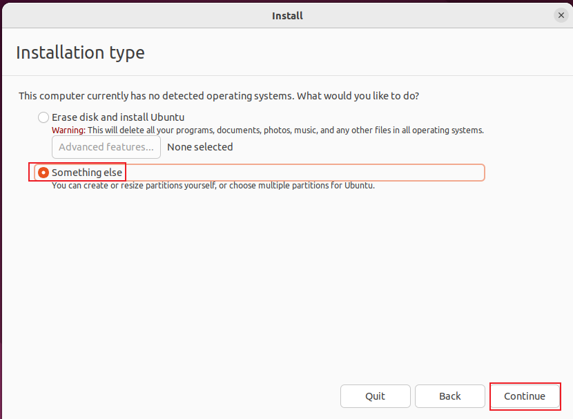
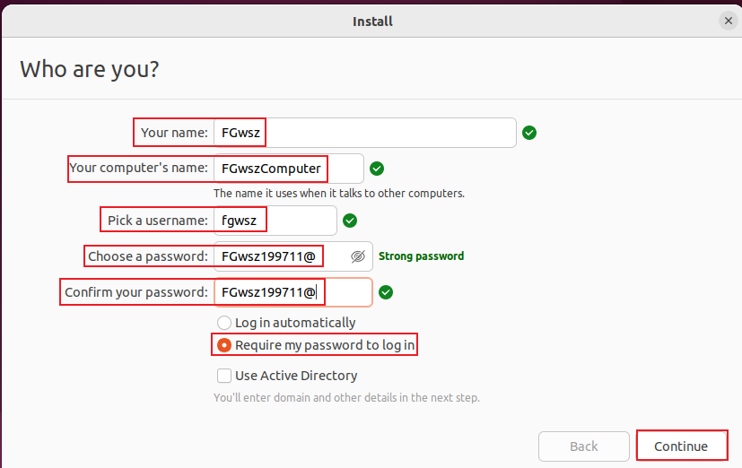

# Ubuntu学习笔记
## 下载
进入官网下载页:<https://cn.ubuntu.com/download>  
点击`下载Ubuntu桌面版`按钮  
  
进入后向下翻,找到`Ubuntu xx.yy.z LTS`  
点击`其他下载`  
  
进入后向下翻,找到`BitTorrent`  
点击`Ubuntu xx.yy.z LTS`栏下的`Ubuntu 桌面版(64位)`按钮  
此时会下载`ubuntu-xx.yy.z-desktop-amd64.iso.torrent`  

下载完成之后,使用BT下载工具打开这个`torrent`文件下载即可  
### 选择其他下载的原因
如果点击`下载xx.yy.z`按钮会开始下载  
但Chinese国情原因,下载速度会很慢(`kb/s`级别 
而且如果下载过程中一旦出现了中断,会造成此次下载失败
## 安装
启动`Ubuntu`系统  
选中第一项`Try or Install Ubuntu`并回车  
  
### 语言
进入`install`界面后  
在左侧的语言栏选择系统语言,这里我选择的是`English`  
然后点击右侧的`Install Ubuntu`按钮  
  
### 键盘布局
进入`Keyboard layout`界面  
选择键盘布局  
我的选择都是`English(US)`  
然后点击`Continue`按钮  
  
### 安装模式
进入`Updates and other software`界面选择安装模式  
有两个选项:`Normal installation`/`Minimal installation`  
在`Normal installation`中,将安装所有 GUI 相关的应用程序  
在`Minimal installation`中只会安装基本的应用程序  
我的选择是`Normal installation`  
注意到`Other options`选项中还有2个选项  
当需要安装所有更新和第三方图形软件和`wifi`驱动程序和额外的媒体格式时  
可以勾选这两个选项,否则保持它们为未勾选状态  
最后,点击右下角的`Continue`按钮  
  
### 安装类型
进入`Installation type`界面选择安装类型  
勾选`Something else`  
点击右下角的`Continue`按钮  
  
### 磁盘分区
#### 新建一个磁盘分区并设置
进入`Installation type`磁盘分区窗口  
右下角的`New Partition Table`按钮用于创建一个新的磁盘分区  
  
点击`Continue`按钮,创建一个新的磁盘分区`free space`  
  
选中刚刚创建的磁盘分区`free space`  
然后点击`+`按钮即可对此分区进行设置  
  
#### 磁盘分区配置
给出一个案例来进行参考  
首先明确一下我的系统可用磁盘空间大概是`200GB`  
`/boot`  2GB  
`/home`  98GB  
`/`      98GB  
`/swap`  2GB  
1. `/boot`  
  
2. `/home`  
  
3. `/`  
  
4. `/swap`  
  
配置完成后,点击`Install Now`按钮开始安装  
  
弹出如下提示  
  
于是重新增加一个`EFI`分区(`(100,250MB]`MB,设置为500MB有备无患)  
  
配置完成后,点击`Install Now`按钮开始安装  
弹出如下提示  
  
于是重新增加一个`BIOS Boot`分区(`>=1MB`)  
  
配置完成后,点击`Install Now`按钮开始安装  
  
点击`Continue`按钮开始安装  
  
### 选择时区
进入`Where are you?`界面  
选择东8区的`Shanghai`  
点击`Continue`按钮  
  
### 账号密码
进入`Who are you?`界面  
输入如下信息  
`Your name`:名字  
`Your computer's name`:电脑名称  
`Pick a username`:普通用户名称(必须全部使用小写字母)  
`password`:密码  
勾选`Require my password to log in`按钮  
点击`Continue`按钮开始安装  
  
至此等待系统安装完成即可  
  
点击`Restart Now`按钮重启系统  
## 使用
### 打开终端
桌面右键单击  
点击`Open in Terminal`按钮  
  
此时终端已打开  
  
### 重启
点击右上角菜单栏  
点击`Power Off/Log Out`按钮  
点击`Restart`按钮  
  
### 安装中文输入法
点击右上角的`Settings`选项  
  
向下翻找到`Region & Language`选项卡  
点击右侧的`Manage Installed Languages`按钮  
  
点击`Install/Remove Languages`按钮  
  
勾选`Chinese(simplified)`选项  
点击`Apply`按钮  
  
`Language for menus and windows:`栏下出现`汉语(中国)`字样  
设置`Keyboard input method system:`栏为`IBus`  
点击`Close`按钮  
  
点击`Keyboard`选项卡  
点击`Input Sources`栏下`+`按钮  
  
点击`Chinese`按钮  
  
点击`Chinese(intelligent pinyin)`按钮  
点击`Add`按钮  
  
此时`Input Sources`栏下出现`Chinese(intellient pinyin)`  
点击右侧的按钮  
点击`Move up`按钮将中文输入法置顶  
  
打开终端,输入如下命令  
```bash
ibus-setup
```
此命令的作用:打开`ibus`管理页面  
点击`Input Method`选项卡下的`Add`按钮  
  
点击`Chinese`按钮  
  
点击`Intelligent Pinyin`按钮  
点击`Add`按钮  
  
切换到`General`选项卡下  
点击`Next input method:`右侧的`...`按钮  
  
#### 设置切换中英文输入法的快捷键为`Ctrl+Space`
> 注意:这是切换中文/英文2个输入法的快捷键  
> 不是中文输入法切换中/英输入的快捷键  
> 中文输入法切换中/英输入的快捷键是`shift`键  

取消勾选`Super`  
勾选`Control`  
点击`Apply`按钮  
点击`Close`按钮  
  
点击`Close`按钮  
  
重启系统  
开机后发现右上角菜单栏出现`中`字样按钮  
至此中文输入法安装成功  
  
安装另一个超好用的ibus输入法:Rime
```bash
sudo apt install ibus-rime
```
上述指令执行完之后输入
```bash
ibus-setup
```
点击`Input Method`标签栏下的`Add`按钮,  
添加`Chinese`下的`Rime`  
其他的设置和上述一开始的`Intelligent Pinyin`输入法一样  
可以在系统设置的`Keyboard`标签栏下添加新的中文输入法  
然后管理输入法的优先级顺序  
`Rime`默认的中文输出方式是中文繁体,在打字弹出输入框的情况下  
按`F4`可以切换到`明月拼音 简化字`即可输出中文简体  
### 安装/配置`Git`
#### 安装`Git`
```bash
sudo apt-get install git
git --version
```
#### 配置`Github`账号信息
```bash
git config --global user.name "your name"
git config --global user.email youremail@example.com
git config --list
```
#### 生成`ssh`密钥
```bash
ssh-keygen -t rsa -C "youremail@example.com"
gedit ~/.ssh/id_rsa.pub
```
把`~/.ssh/id_rsa.pub`里的全部内容复制到剪切板  
#### 连接到`github`
登录`github`账号  
点击`Settings`按钮  
  
切换到`SSH and GPG keys`栏  
点击`New SSH key`按钮  
  
`Title`输入标题  
`Key type`选择`Authentication Key`  
`Key`栏粘贴`~/.ssh/id_rsa.pub`里的全部内容  
  
至此添加`ssh`到`github`成功  
  
测试一下是否可以`ssh`到`github`  
```bash
ssh -T git@github.com
```
如下图所示,证明配置成功  
  
### 更换`apt`软件源
用`root`权限编辑`/etc/apt/sources.list`修改为如下内容:  
文件内容来自清华大学开源软件镜像站:
<https://mirrors.tuna.tsinghua.edu.cn/help/ubuntu/>  
以及阿里云镜像:
<https://developer.aliyun.com/mirror/ubuntu>  
```txt
# ============================================================================
# 清华源
# ============================================================================
# 默认注释了源码镜像以提高 apt update 速度，如有需要可自行取消注释
deb https://mirrors.tuna.tsinghua.edu.cn/ubuntu/ jammy main restricted universe multiverse
# deb-src https://mirrors.tuna.tsinghua.edu.cn/ubuntu/ jammy main restricted universe multiverse
deb https://mirrors.tuna.tsinghua.edu.cn/ubuntu/ jammy-updates main restricted universe multiverse
# deb-src https://mirrors.tuna.tsinghua.edu.cn/ubuntu/ jammy-updates main restricted universe multiverse
deb https://mirrors.tuna.tsinghua.edu.cn/ubuntu/ jammy-backports main restricted universe multiverse
# deb-src https://mirrors.tuna.tsinghua.edu.cn/ubuntu/ jammy-backports main restricted universe multiverse

# 以下安全更新软件源包含了官方源与镜像站配置，如有需要可自行修改注释切换
deb http://security.ubuntu.com/ubuntu/ jammy-security main restricted universe multiverse
# deb-src http://security.ubuntu.com/ubuntu/ jammy-security main restricted universe multiverse

# 预发布软件源，不建议启用
deb https://mirrors.tuna.tsinghua.edu.cn/ubuntu/ jammy-proposed main restricted universe multiverse
# # deb-src https://mirrors.tuna.tsinghua.edu.cn/ubuntu/ jammy-proposed main restricted universe multiverse
# ============================================================================
# 阿里云源
# ============================================================================
deb https://mirrors.aliyun.com/ubuntu/ jammy main restricted universe multiverse
deb-src https://mirrors.aliyun.com/ubuntu/ jammy main restricted universe multiverse

deb https://mirrors.aliyun.com/ubuntu/ jammy-security main restricted universe multiverse
deb-src https://mirrors.aliyun.com/ubuntu/ jammy-security main restricted universe multiverse

deb https://mirrors.aliyun.com/ubuntu/ jammy-updates main restricted universe multiverse
deb-src https://mirrors.aliyun.com/ubuntu/ jammy-updates main restricted universe multiverse

# deb https://mirrors.aliyun.com/ubuntu/ jammy-proposed main restricted universe multiverse
# deb-src https://mirrors.aliyun.com/ubuntu/ jammy-proposed main restricted universe multiverse

deb https://mirrors.aliyun.com/ubuntu/ jammy-backports main restricted universe multiverse
deb-src https://mirrors.aliyun.com/ubuntu/ jammy-backports main restricted universe multiverse
```
执行`sudo apt update`即可看到上述软件源更新的信息.  
但是可能会因为前期/软件配置一些原因,  
会发现一些没有写在`/etc/apt/source.list`里面的软件源信息,  
那么这些软件源信息保存在哪里呢?  
答案是在`/etc/apt/source.list.d/`这个文件夹里.  
### 安装`Vim/GVim 8.2`
1.方式一
打开`Ubuntu Software`  
  
搜索`GVim`然后点进去点击`install`按钮即可  
  
2.方式二
```bash
sudo apt install vim
sudo apt install vim-gtk3
```
### 删除无用的应用图标
系统图标:`/usr/share/applications`  
用户应用:`~/.local/share/applications`  
进入上述文件夹之后使用`grep`/`vim`的高亮查找功能锁定对应的文件,删除即可.  
### AppImage包如何使用
AppImage包本身是一个可执行文件  
但是需要先安装FUSE  
然后赋予可执行权限  
最后执行即可  
```bash
sudo apt-get install fuse
chmod +x ./xxx.AppImage
./xxx.AppImage
```
### 修改`gnome`显示样式
```bash
sudo apt install gnome-tweaks
gnome-tweaks
```
### 配置`ibus-rime`输入法
#### 设置横排显示候选项
```bash
gvim ~/.config/ibus/rime/build/ibus_rime.yaml
```
修改该文件的如下内容(#标注的)  
```yaml
style:
  cursor_type: insert
  horizontal: true #横排显示候选项
  inline_preedit: true
  preedit_style: composition
```
#### 使用`shift`切换的时候清除已输入字符
```bash
gvim ~/.config/ibus/rime/build/default.yaml
```
修改该文件的如下内容(#标注的)  
```yaml
ascii_composer:
  good_old_caps_lock: true
  switch_key:
    Caps_Lock: clear
    Control_L: noop
    Control_R: noop
    Eisu_toggle: clear
    Shift_L: clear #inline_ascii
    Shift_R: clear #commit_text
```
#### 重新配置`ibus-rime`
鼠标左键单击右上角的语言栏`ibus`图标  
鼠标左键单击选中`Chinese(Rime)`  
鼠标左键单击选中`部署`  
等待一会儿会显示提示`Rime is ready`  
至此重新配置ibus-rime成功  
### 使用`ripgrep`替换`grep`
安装  
```bash
sudo apt install ripgrep
rg --version
```
替换:在`~/.bashrc`中输入如下内容  
```bash
alias grep='rg'
```
### 更换`DNS`服务器
```bash
sudo gvim /etc/systemd/resolved.conf
```
添加如下内容并保存:  
```txt
DNS=8.8.8.8 114.114.114.114
FallbackDNS=8.8.8.8
```
然后依次执行如下命令:  
```bash
sudo systemctl restart systemd-resolved
sudo systemctl enable systemd-resolved
sudo mv /etc/resolv.conf /etc/resolv.conf.bak
sudo ln -s /run/systemd/resolve/resolv.conf /etc/
```
再查看/etc/resolv.conf文件就可以看到新的dns信息已经写入其中了.  
```bash
sudo gvim /etc/resolv.conf
```
`etc/resolv.conf`文件发现如下内容:  
```txt
nameserver 8.8.8.8
nameserver 114.114.114.114
```
此时更换DNS服务器完成  
### 修复`Grub` `Windows11`引导项
```bash
sudo gvim /etc/default/grub
```
设置默认启动项为第一个  
设置显示菜单  
设置停留时间为10秒  
```txt
GRUB_DEFAULT=0
GRUB_TIMEOUT_STYLE=menu
GRUB_TIMEOUT=10
```
保存上述更改,执行如下指令  
```bash
sudo update-grub
```
重启计算机即可解决
### 修复`Ubuntu`启动显示`SGX disable by BIOS`问题
```bash
sudo gvim /etc/default/grub
```
设置不使用`SGX`  
```txt
GRUB_CMDLINE_LINUX_DEFAULT="quiet splash nosgx"
```
保存上述更改,执行如下指令  
```bash
sudo update-grub
```
重启计算机即可解决
### 修复`Ubuntu`开机时间长问题
打印启动时间信息  
打印启动时服务占比最多的10个服务  
```bash
systemd-analyze 
systemd-analyze blame | head -n 10
```
运行结果如下  
```txt
Startup finished in 4.429s (kernel) + 55.235s (userspace) = 59.665s 
graphical.target reached after 55.125s in userspace
31.520s plymouth-quit-wait.service
22.053s e2scrub_reap.service
15.839s snapd.seeded.service
14.751s snapd.service
13.303s networkd-dispatcher.service
11.637s udisks2.service
10.939s dev-sda6.device
 8.390s systemd-journal-flush.service
 7.438s grub-common.service
 7.416s NetworkManager-wait-online.service
```
关闭一些不必要的开机启动服务  
```bash
sudo systemctl stop plymouth-quit-wait.service
sudo systemctl stop e2scrub_reap.service
sudo systemctl stop snapd.seeded.service
sudo systemctl stop snapd.service
sudo systemctl disable plymouth-quit-wait.service
sudo systemctl disable e2scrub_reap.service
sudo systemctl disable snapd.seeded.service
sudo systemctl disable snapd.service
```
重启计算机  
遇到的问题:尝试上述操作之后,耗费时间的开机启动服务仍然开机启动,并没有被关闭
### 安装`spark-store`
进入官网下载页:<https://www.spark-app.store/download_latest>  
点击`软件本体`下的`点击下载`  
此时会弹出一个安装说明Q&A界面,点击界面右下角的`开始下载`按钮  
此时会跳转到gitee的界面,点击`下载`下的其中一个`spark-store_xxxx_amd64.deb`  
开始下载,下载完成之后,输入如下指令  
```bash
cd ~/Download
sudo dpkg -i spark-store_xxxx_amd64.deb # xxxx填下载的软件包的版本号
# 提示缺少一些软件依赖
sudo apt --fix-broken install
sudo dpkg -i spark-store_xxxx_amd64.deb # xxxx填下载的软件包的版本号
```
### 安装`wine`版微信
打开安装好的`spark-store`  
可以使用如下命令  
```bash
spark-store
```
在搜索框里面搜索`微信`  
找到`微信(wine)`应用点击安装`Download and Install`按钮即可开始安装  
安装完毕之后在开始菜单中点击对应的应用图标即可打开应用  
### 安装`wine`
安装方式参考:<https://mirrors-i.tuna.tsinghua.edu.cn/help/wine-builds/>  
首先启用32位架构  
```bash
sudo dpkg --add-architecture i386
```
之后信任来自<https://dl.winehq.org/>的公钥  
```bash
sudo wget -nc -O /usr/share/keyrings/winehq-archive.key https://dl.winehq.org/wine-builds/winehq.key
```
注意:如果获取公钥提示错误,那么请使用如下命令重新获取  
```bash
sudo rm -rf /usr/share/keyrings/winehq-archive.key
sudo wget -nc -O /usr/share/keyrings/winehq-archive.key https://dl.winehq.org/wine-builds/winehq.key
```
注意:这里有一个不知道真伪性的方式,为了解决下载时的仓库冲突,我删除了如下文件  
这个文件的产生来源于`wine`官网的安装教程<https://wiki.winehq.org/Ubuntu_zhcn>  
上述官网教程网址请使用`OpenDNS`解析打开  
但是由于我国国情原因,无法连接到<https://dl.winehq.org>进行下载  
于是方式使用`wine`官网的安装方式,但是尝试之后会生成如下文件,为了避免干扰,  
索性直接删除  
```bash
sudo rm -rf  /etc/apt/sources.list.d/winehq-jammy.sources
```
新增`/etc/apt/sources.list.d/winehq.list`,内容为
```txt
deb [arch=amd64,i386 signed-by=/usr/share/keyrings/winehq-archive.key] https://mirrors.tuna.tsinghua.edu.cn/wine-builds/ubuntu/ jammy main
```
通过以下命令安装`winehq`  
```bash
sudo apt update
sudo apt install --install-recommends winehq-stable
```
安装完成之后,查看版本信息  
```bash
wine --version
```
至此`wine`安装完成  
### 安装`obs`
`obs`官网安装教程:<https://obsproject.com/download#linux>  
`obs`安装方式  
```bash
sudo add-apt-repository ppa:obsproject/obs-studio
sudo apt update
sudo apt install ffmpeg obs-studio
```
查看`obs`版本信息  
```bash
obs --version
```
启动`obs`  
```bash
obs
```
至此`obs`安装完毕  
### 设置`obs`进行`bilibili`直播推流
打开obs  
```bash
obs
```
#### 分享整个屏幕(声音采集电脑音频,不会采集麦克风和外部输入)
在最下方的`Source`面板下选择`+`按钮  
然后选择`Screen Caputure(PipeWire)`  
此时会弹出一个`Screen Share`窗口  
选中`Bulit-in display`按钮,然后点击`Share`按钮  
也可以选择`Screen Caputure(XSHM)`  
此时会弹出一个`Create/Select Source`窗口  
点击右下角的`OK`按钮即可  
#### 获取`bilibili`直播间串流密钥
进入bilibili官网:<https://www.bilibili.com/>  
登录个人帐号,然后点击个人头像,点击`个人中心`>>`直播中心`>>`我的直播间`  
快捷网址:<https://link.bilibili.com/p/center/index#/my-room/start-live>  
选择一个`直播分区`的标签  
然后点击`开始直播`  
然后将`串流密钥`复制到剪切板  
#### 开始直播推流
选中`obs`最上方菜单栏的`File`>>`Settings`>>`Stream`  
进入`Stream`设置界面  
`Service`选择`Bilibili Live - RTMP`  
`Server`选择`Chinese Mainland - Backup`  
`Server`也可以选择`Default`  
`Stream Key`中粘贴获取到的`bilibili`直播间串流密钥  
点击`OK`和`Apply`按钮  
然后点击`obs`右下角的`Controls`面板上的`Start Streaming`  
即可开始推流  
#### 关闭直播的方式
首先点击`obs`右下角的`Controls`面板上的`Stop Streaming`  
关闭推流  
然后进入<https://link.bilibili.com/p/center/index#/my-room/start-live>  
点击`关闭直播`按钮  
### 设置性能模式
#### 设置电源性能模式
打开控制中心  
```bash
gnome-control-center
```
选择`Power`面板  
在`Power Mode`面板下选择  
`Performance`高性能模式  
`Balanced`平衡模式  
`Power Saver`省电模式  
#### 查看`CPU`的当前管理模式  
```bash
cat /sys/devices/system/cpu/cpu*/cpufreq/scaling_governor
```
`scaling_governor`内容表示的含义:  
`performance`最高性能,最高频率,不考虑耗电  
`interactive`一开始使用最高频率,然后根据`CPU`负载慢慢降低  
`powersave`省电模式,通常以最低频率运行,系统性能会受到影响  
`userspace`可以在用户空间手动调节频率  
`ondemand`定时检查负载,根据负载来调节频率,负载低的时候降低`CPU`频率,
负载高的时候提高`CPU`频率  
`*`的意思表示匹配`CPU`编号  
#### 设置`CPU`性能模式
首先安装`cpufrequtils`  
```bash
sudo apt-get install cpufrequtils
```
安装完成后,可以使用如下命令来查看`CPU`的个数和实时频率信息  
```
cpufreq-info
```
注意:重要的一点是此命令可以查看`CPU`支持设置的性能模式  
```txt
analyzing CPU 0:
  driver: intel_pstate
  CPUs which run at the same hardware frequency: 0
  CPUs which need to have their frequency coordinated by software: 0
  maximum transition latency: 4294.55 ms.
  hardware limits: 400 MHz - 4.40 GHz
  available cpufreq governors: performance, powersave
```
上述`CPU`只支持设置为`performance`和`powersave`  
然后可以暂时设置一下性能模式(以设置`performance`模式为例)(重启会失效)  
```bash
sudo cpufreq-set -g performance
```
然后安装`sysfsutils`  
```bash
sudo apt-get install sysfsutils
```
使用管理员权限编辑`/etc/sysfs.conf`  
```bash
sudo gvim /etc/sysfs.conf
```
在文件的最后面增加如下内容(以设置`performance`模式为例)  
```txt
devices/system/cpu/cpu0/cpufreq/scaling_governor = performance
devices/system/cpu/cpu1/cpufreq/scaling_governor = performance
devices/system/cpu/cpu2/cpufreq/scaling_governor = performance
devices/system/cpu/cpu3/cpufreq/scaling_governor = performance
devices/system/cpu/cpu4/cpufreq/scaling_governor = performance
devices/system/cpu/cpu5/cpufreq/scaling_governor = performance
#按照上述语句的格式可以继续填写,语句的条数取决于计算机的CPU数量
```
也可以通过一个bash脚本来完成上述内容(请使用`root`账户来执行该脚本)  
```bash
#!/bin/bash
# 获取当前系统的cpu数量
cpu_count=$(nproc)
# 向/etc/sysfs.conf尾部增加语句
for ((i=0; i<cpu_count; i++)); do
    echo "devices/system/cpu/cpu$i/cpufreq/scaling_governor = performance" >> /etc/sysfs.conf
done
```
上述操作完毕之后,重启计算机,重启之后使用如下命令查看是否生效  
```
cat /sys/devices/system/cpu/cpu*/cpufreq/scaling_governor
cpufreq-info
```
至此设置`CPU`性能模式结束  
除了上述的终端设置方式,还可以采用`GUI`窗口操作设置的方式  
安装`cpupower-gui`  
```bash
sudo apt-get install cpupower-gui
```
然后在开始菜单找到此应用的图标点击即可运行,
操作方式和上述设置方式类似,不再赘述.  
注意:这个`cpupower-gui`应用安装之后会将它自带的默认设置应用到计算机,
可能会覆盖掉终端方式设置的`CPU`性能模式,最好自己设置一下再使用.  
性能模式推荐:  
`ondemand`指的是平时以低速方式运行,当系统负载提高时候自动提高频率.
以这种模式运行不会因为降频造成性能降低,同时也能节约电能和降低温度.  
`performance`指满速运行(超频),即使系统负载非常低,`CPU`的频率也为最高频率,
性能很好,但是电量消耗较快,温度也高一些,这可能会对`CPU`和其他硬件造成损害,
从而降低硬件的使用寿命.  
#### 关于`CPU超频`(`Overclocking`)
这里引入`CPU超频`(超越基础时钟频率)的知识:  
首先可以在终端查一下计算机的`CPU`型号  
```bash
sudo apt-get install neofetch
neofetch
```
列举一个具体案例:  
例如查看到如下的`CPU`信息  
```txt
CPU: Intel i5-9400 (6) @ 4.100GHz 
```
我们可以通过`bing`搜索引擎来查看一下该型号`CPU`的基础频率信息  
```txt
2.90 GHz (4.10 GHz)
CPU核心数与基础频率 Intel Core i5-9400 有 6 个核心
Intel Core i5-9400 的时钟频率为 2.90 GHz (4.10 GHz)
```
也就是说我们的`CPU`的实时运行频率只要超过基础时钟频率(2.9GHz)
就属于`CPU超频`了.  
`performance`模式下`CPU`用最大运行频率(4.10GHz)运行属于`CPU超频`.  
已设置`performance`模式的`Intel Core i5-9400 CPU`的某一时刻的运行频率如下  
```bash
grep 'cpu MHz' /proc/cpuinfo
```

```txt
cpu MHz         : 800.000
cpu MHz         : 4066.256
cpu MHz         : 4046.383
cpu MHz         : 4048.137
cpu MHz         : 4076.363
cpu MHz         : 800.000
```
至此关于`CPU超频`的论述结束.  
### 设置应用为开机启动
打开开机启动设置界面  
```bash
gnome-session-properties
```
在这个界面上进行`Add`,`Remove`,`Edit`即可  
例如添加一个开机启动项目:开机启动`gvim`  
点击`Add`按钮会打开一个`Add Startup Program`界面  
在`Name:`中输入该启动项的名字`gvim`  
在`Command:`中输入执行该启动项的`bash`命令`gvim .`  
在`Comment:`中撰写该启动项的注释说明  
填写完毕之后点击窗口右下角的`Add`按钮  
至此一个开机启动项目添加成功  
注意:开机启动项目成功不代表会生效,
不难注意到每个开机启动项目前面都有一个勾选框,如果此勾选框被勾选,
则说明该开机启动项目是生效的  
根据需要编辑完成之后,点击窗口右下方的`Close`按钮关闭窗口  
至此,设置开机启动项结束  
上面讲了设置开机启动项需要应用的`bash`命令.  
但是怎么得到已经安装了的应用(可以在开始菜单中看到)的`bash`调用命令呢?  
1. 打开`System Monitor`(资源管理器)查看正在运行的应用的  
属性页中的`Command Line`就得到了这个应用的`bash`调用命令.  
2. 从源头解决问题:进入如下目录`/usr/share/applications/`  
查找你要找的应用的`.desktop`文件,使用文本编辑器打开这个文件进行查看.  
找到如下的一行.  
```bash
Exec=
```
`Exec=`后面的就是这个应用的`bash`调用命令.  
### 在桌面上显示键盘事件
安装`screenkey`  
```bash
sudo apt-get install screenkey
```
使用`screenkey`  
```bash
screenkey
```
设置`screenkey`  
打开`screenkey`之后会在屏幕最右上角的状态栏显示一个小图标(键盘图案)  
鼠标单击此图标,点击`Perferences`按钮进入设置界面  
#### 设置信息显示位置
设置界面的功能显示非常清晰,按照需求选择即可  
有一个比较麻烦的功能设置在此记录一下  
点击`Position`下的`Select window/region`即可开始选择显示信息的区域  
在合适的位置选中一个矩形框  
鼠标左键第一次点击的位置是矩形的左上角  
鼠标左键松开的位置是矩形的右下角  
至此设置显示信息区域完毕  
注意:不管字体字号设置如何,都不会超出显示区域的范围,
因此显示区域的宽度和高度尤为重要  
### 屏幕跟随鼠标光标位置放大/缩小(Zoom)
打开设置  
```bash
gnome-control-center
```
在`Keyboard`面板下滑动到最下方  
点击`Keyboard Shortcuts`面板下的`View and Customize Shortcuts`按钮  
在搜索框中搜索`Zoom`  
会显示如下搜索结果  
`Turn zoom on or off`设置`Zoom`功能打开/关闭  
`Zoom in`放大  
`Zoom out`缩小  
点击这三个搜索结果后面的快捷键即可重新设置该功能的全局快捷键  
为了使用方便,我设置了如下的快捷键组合:  
`Turn zoom on or off`设置`Ctrl+Space`  
`Zoom in`设置`Ctrl+8`  
`Zoom out`设置`Ctrl+/`  
注意:`Zoom`放大的区域中默认是以屏幕最中央为中心点放大的,
并不是以鼠标光标所在的点为中心点,
但是可以通过移动鼠标光标的位置来使得`Zoom`放大区域的矩形跟随鼠标光标移动.  
### 当操作系统版本信息不正确时如何还原
修改如下的两个文件:  
将`/etc/lsb-release`修改为如下内容:  
```txt
DISTRIB_ID=Ubuntu
DISTRIB_RELEASE=22.04 LTS
DISTRIB_CODENAME=bookworm
DISTRIB_DESCRIPTION="Ubuntu 22.04 LTS"
```
将`/etc/os-release`修改为如下内容:  
```txt
PRETTY_NAME="Ubuntu (linux) 2022.04 LTS"
NAME="Ubuntu"
VERSION_ID="22.04 LTS"
VERSION="22.04"
VERSION_CODENAME=bookworm
ID=ubuntu
ID_LIKE=Debian
HOME_URL="https://cn.ubuntu.com"
OS_LIKE="Ubuntu"
```
修复`Grub`引导项中的操作系统版本信息  
编辑文件`/etc/default/grub`  
将`GRUB_DISTRIBUTOR`这一行修改为如下内容
```txt
GRUB_DISTRIBUTOR=`lsb_release -i -s 2> /dev/null || echo Ubuntu`
```
然后重新生成`Grub`配置文件,以应用修改  
```bash
sudo update-grub
```
重新启动计算机,以使修改生效  
如果此时还是没有识别到正确的操作系统信息,
请直接编辑`/boot/grub/grub.cfg`的内容来进行手动修改引导项中操作系统信息  
重新启动计算机,以使修改生效  
### 修改`Grub`引导菜单界面的颜色
编辑`/boot/grub/grub.cfg`的这两行  
下面的第一行是设置菜单的字体颜色和背景颜色  
下面的第二行是设置正在选中的菜单项的字体颜色和背景颜色  
```txt
set menu_color_normal=white/black
set menu_color_highlight=yellow/blue
```
修改完成之后,重新启动计算机,以使修改生效  
### 安装缺失的字体
查看系统已安装的全部字体  
```bash
fc-list
```
查找已安装的字体  
```bash
fc-list | grep [regex] # 这里[regex]指的是正则表达式
```
建立一个文件夹(以`my-fonts-dir`为例)
用于存放已经下载好的系统缺失的字体文件(`.ttf`)  
```bash
#复制字体文件夹到/usr/share/fonts/目录下
sudo cp -r my-fonts-dir /usr/share/fonts/
cd /usr/share/fonts/my-fonts-dir/
#生成字体索引信息
sudo mkfontscale
sudo mkfontdir
#更新字体缓存
fc-cache
```
### 升级`nodejs`和`npm`到最新版本
如果已经安装过`nodejs`,请使用如下命令删除:  
```bash
sudo apt-get purge nodejs
sudo apt remove libnode-dev
sudo dpkg --remove --force-remove-reinstreq libnode-dev
sudo dpkg --remove --force-remove-reinstreq libnode72:amd64
```
删除之后,使用如下命令安装最新版`nodejs`和`npm`  
```bash
sudo apt update
sudo apt install curl
# 下面的18指的是nodejs的大版本号,填入你需要的最新版版号即可
curl -fsSL https://deb.nodesource.com/setup_18.x | sudo -E bash -
sudo apt install -y nodejs
```
最后输入如下命令查看一下安装好的`nodejs`和`npm`的版本信息  
```bash
node -v
npm -v
```
### 安装`Steam`
进入`Steam`官网下载页面<https://store.steampowered.com/about/>  
点击`安装 STEAM`按钮开始下载`steam_latest.deb`  
下载完成之后,在终端进入`steam_latest.deb`的所在目录,输入如下命令:  
```bash
sudo dpkg -i steam_latest.deb # 安装steam
steam # 运行steam
```
至此`Steam`安装完成.
### 文件管理器文件显示视频缩略图
```bash
sudo apt install gstreamer1.0-libav
sudo apt install ffmpegthumbnailer
```
输入上述命令,重新打开文件管理器,就能看到视频文件的缩略图.  
### 增大`gnome`显示字体
```bash
gnome-control-center
```
输入上述命令打开设置.  
然后选中`Accessibility`>>`Seeing`>>`Large Text`按钮,点击打开.  
至此,增大`gnome`显示字体完成.  
### 安装flash
安装`flash`  
```bash
sudo apt-get update
sudo apt install flash
flash --version
```
`Edge`浏览器安装`flash`插件  
打开`Edge`浏览器的插件商店,搜索并安装`Ruffle-Flash Emulator`插件.  
### 安装`GBA`模拟器`mGBA`
`mGBA`模拟器官网下载地址:<https://mgba.io/downloads.html>  
选择对应的`Ubuntu`版本下载安装包即可.  
下载下来之后是`***.tar.xz`压缩包.  
使用归档管理器解压缩会得到3个`.deb`安装文件.  
右键点击其中的`mgba-qt.deb`选择`Open With Software Install`左键单击,  
如果没有没有上述的右键菜单选项,可以使用两种方式解决.  
1. 选择`Open With Other Application`选项左键单击,  
然后选择`Software Install`选项,点击`Select`按钮.  
2. 选择`Properties`选项左键单击,  
选中`Open With`选项卡,选中`Software Install`,然后点击`Set as default`按钮.  
(更改文件拓展名的默认打开应用)  

打开之后会有一段等待的时间,然后会打开应用商店跳转到`mGBA`应用页面,  
点击`Install`按钮,会跳出一个输入用户密码的页面,输入完用户密码,  
等待安装完毕即可.  
安装完毕之后,使用如下命令运行.  
```bash
mgba-qt
```
### 查看攻击者的`ip`地址
查看用户登录的ip地址.  
```bash
last --ip
```
查看日志条数  
```bash
wc -l /var/log/auth.log
```
查看日志中密码验证失败的条数  
```bash
grep "Failed password" /var/log/auth.log | wc -l
```
查看日志中密码验证失败的日志行  
```bash
grep "Failed password" /var/log/auth.log
```
### 使用`Epson Scan2`连接网络打印机(`Epson`打印机)进行纸质文件扫描
安装`avahi-browse`(查找局域网网络打印机的工具)  
```bash
sudo apt-get install avahi-utils
```
安装完之后,使用如下命令来搜索可用的网络打印机  
```bash
avahi-browse --all -t -r
```
将搜索到的网络打印机的`ip`地址记录下来,后面要用到.  
下载`Epson Scan2`  
下载网址:<https://support.epson.com.cn/linux/en/epsonscan2.php>  
进入之后根据操作系统进行选择即可.  
下载完成之后会是一个`xxx.tar.gz`  
使用归档管理器解压缩之后,会发现是一个文件夹,进入这个文件夹,  
运行里面的`install.sh`即可完成`Epson Scan2`的安装.  
使用如下命令来打开`Epson Scan2`  
```bash
epsonscan2
```
进入之后会发现,有一个打印机的驱动选择界面,如果没有找到打印机驱动,  
那么会显示一个`Add`按钮,双击这个`Add`按钮,  
在`Address`栏输入上面使用`avahi-browse`获取到的网络打印机的`ip`地址,  
然后点击`OK`即可开始和网络打印机进行连接,  
稍微等待一会儿,等待连接完成,会弹出一个打印机`Information`窗口,  
在这个窗口中进行扫描设置,将纸质文件放到打印机的扫描平台上,  
设置完毕之后,点击右下角的`Scan`按钮,即可开始扫描,  
也可以先点击左下角的`Preview`按钮,进行扫描结果的预览,然后重新调整设置等等,  
至此设置完毕,开始愉快地扫描吧.  
### 永久关闭错误弹窗
在`Ubuntu`使用过程中,有时会经常弹出提示框"检测到系统程序出现问题",怎么回事?  
原因:这是`Ubuntu`中的系统错误弹窗,一旦有一个程序崩溃了,  
你就会看到"检测到系统程序出现问题"的弹窗.  
解决办法:  
想要不再弹出`Ubuntu`中的上述弹窗,需要将`Apport`禁止,  
并且彻底地摆脱`Ubuntu`系统中的程序崩溃报告,  
具体做法是编辑`/etc/default/apport`文件最后一行,  
把`enabled=1`改为`enabled=0`,然后保存并关闭该文件.  
### `dpkg`错误
在使用`sudo apt-get install`的时候出现如下错误:  
```bash
dpkg: error processing package shim-signed (--configure):
 installed shim-signed package post-installation script subprocess returned error exit status 127
Errors were encountered while processing:
 shim-signed
E: Sub-process /usr/bin/dpkg returned an error code (1)
```
解决方式:  
```bash
sudo mv /var/lib/dpkg/info /var/lib/dpkg/info.bak
sudo mkdir /var/lib/dpkg/info
sudo apt-get update
sudo apt-get install shim-signed
sudo mv /var/lib/dpkg/info/* /var/lib/dpkg/info.bak/
sudo rm -rf /var/lib/dpkg/info
sudo mv /var/lib/dpkg/info.bak /var/lib/dpkg/info
```
### 安装`NDS`模拟器`melonDS`
安装并生成执行文件:  
```bash
sudo apt install cmake extra-cmake-modules libcurl4-gnutls-dev libpcap0.8-dev libsdl2-dev libarchive-dev libenet-dev libzstd-dev
sudo apt install qt6-base-dev
sudo apt install qt6-base-private-dev
sudo apt install qt6-multimedia-dev
sudo apt install libqt6svg6-dev
cd ~/Downloads
git clone https://github.com/melonDS-emu/melonDS
cd melonDS
cmake -B build
cmake --build build -j$(nproc --all)
```
生成的可执行文件的路径:`~/Downloads/melonDS/build/melonDS`  
运行`melonDS`模拟器:  
```bash
~/Downloads/melonDS/build/melonDS
```
### 安装`7-zip`
```bash
sudo apt-get install p7zip-full
```
### 安装`Vim/GVim 9.1`
安装方式来自于`Vim`官方发布的`vim-appimage`仓库的`releases`页:  
<https://github.com/vim/vim-appimage/releases/tag/v9.1.0995>
```bash
wget -O ~/Downloads/gvim.appimage https://github.com/vim/vim-appimage/releases/download/v9.1.0995/GVim-v9.1.0995.glibc2.29-x86_64.AppImage
wget -O ~/Downloads/vim.appimage https://github.com/vim/vim-appimage/releases/download/v9.1.0995/Vim-v9.1.0995.glibc2.29-x86_64.AppImage
chmod +x ~/Downloads/gvim.appimage
chmod +x ~/Downloads/vim.appimage
```
安装完成之后,需要将老版本的`Vim/GVim 8.2`的命令行启动方式替换掉.  
在`.bashrc`中进行如下修改:  
```bash
alias gvim='~/Downloads/gvim.appimage'
alias vim='~/Downloads/vim.appimage'
```
存在的问题:  
1. `GVim 9.1`无法使用中文输入法;  
2. `GVim 9.1` `Netrw` `x`打开文件的功能无效.  

综上还是继续使用`Vim/GVim 8.2`好了.  
此外还有一个未尝试的待选项`vim-gtk3 9.1`.  
### 关闭`IBus`在应用窗口中启用内嵌编辑模式
关闭`IBus`在应用窗口中启用内嵌编辑模式功能,  
有助于解决一部分应用程序中无法使用`IBus`来输入非英文文字的问题.  
使用如下命令来打开`IBus`设置界面:  
```bash
ibus-setup
```
点击`General`选项卡,取消勾选`Embed preedit text in application window`选项.  
重启计算机,应用生效.  
