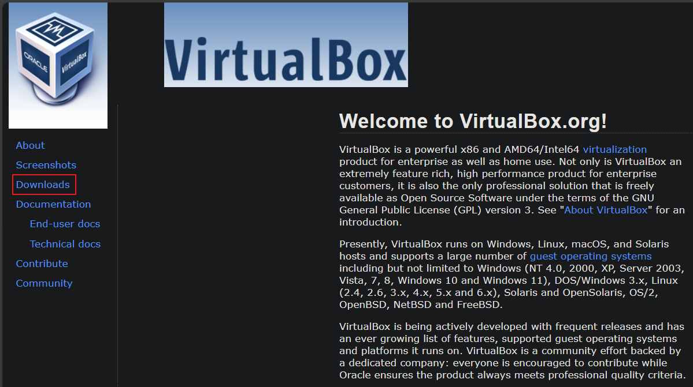
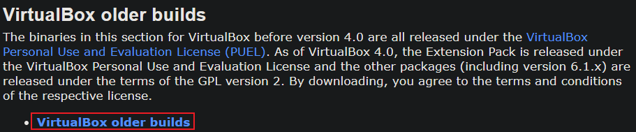
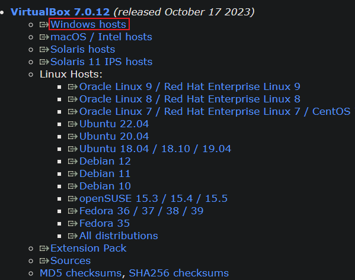
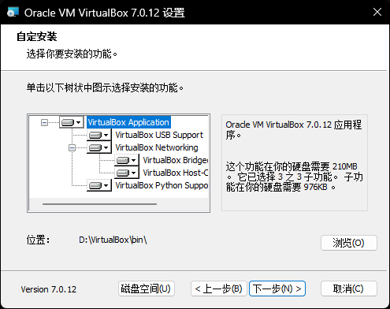

# `VirtualBox` 学习笔记
## 下载
首先进入官网网址:<https://www.virtualbox.org/>  
然后点击左侧`Downloads`按钮  
  
进入后向下翻,找到`VirtualBox older builds`  
点击`VirtualBox older builds`按钮  
  
点击`VirtualBox 7.0`按钮  
  
进入后向下翻,找到`VirtualBox 7.0.12`  
点击`Windows hosts`按钮开始下载安装包  
  
### 为什么下载老版本的`VirtualBox`?
因为新版本`(version>7.0.12)`的`VirtualBox`  
在自定义安装的时候,如果自定义的安装目录是系统盘`C:`之外的目录,  
会出现报错信息:`invalid installation directory`  
## 安装
建立如下目录结构,并将下载好的安装包放到`install/`下  
```txt
D:\VIRTUALBOX
├───bin
├───install
│       VirtualBox-7.0.12-159484-Win.exe
│
└───userdata
```
执行`VirtualBox-7.0.12-159484-Win.exe`开始安装  
设置自定义安装目录为`bin/`下  
  
点击`下一步` `安装`等按钮完成安装即可  
## 使用
### 新建一个虚拟机