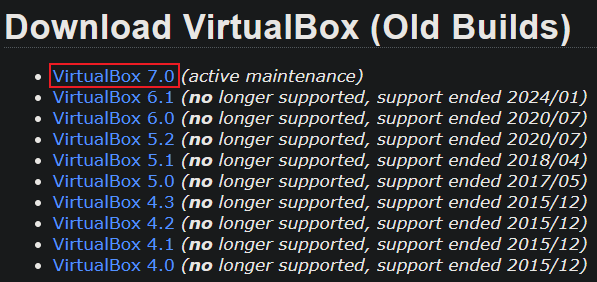
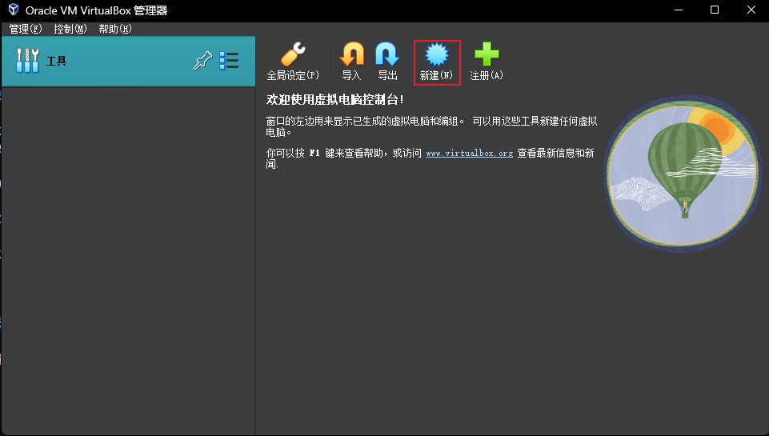
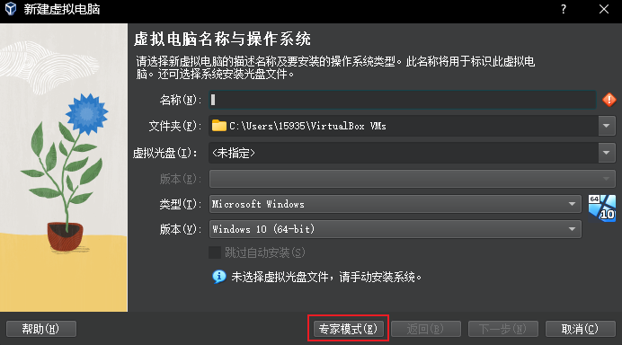
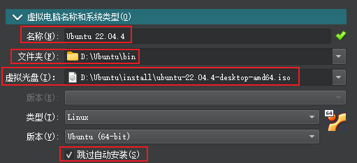
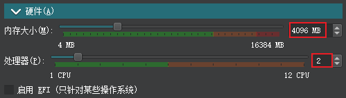
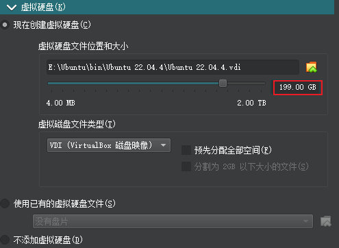
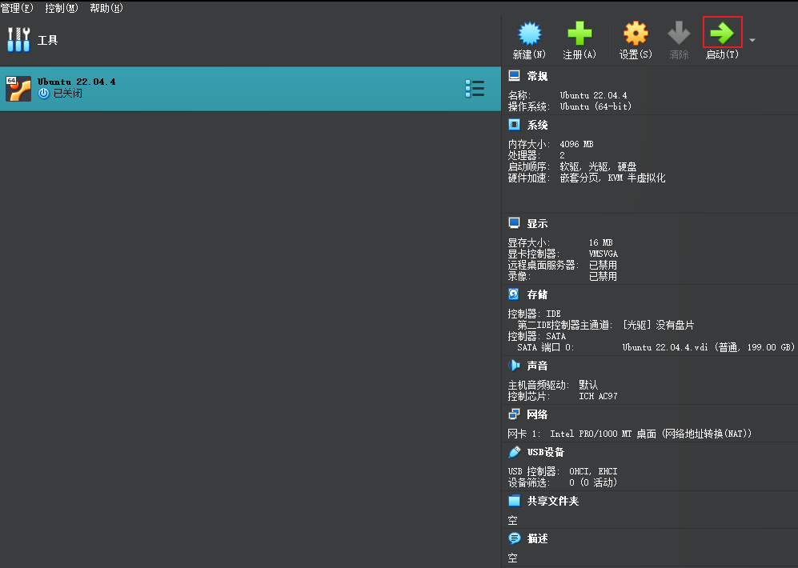

# `VirtualBox` 学习笔记
## 下载
首先进入官网网址:<https://www.virtualbox.org/>  
然后点击左侧`Downloads`按钮  
  
进入后向下翻,找到`VirtualBox older builds`  
点击`VirtualBox older builds`按钮  
  
点击`VirtualBox 7.0`按钮  
  
进入后向下翻,找到`VirtualBox 7.0.12`  
点击`Windows hosts`按钮开始下载安装包  
  
### 为什么下载老版本的`VirtualBox`?
因为新版本`(version>7.0.12)`的`VirtualBox`  
在自定义安装的时候,如果自定义的安装目录是系统盘`C:`之外的目录,  
会出现报错信息:`invalid installation directory`  
## 安装
建立如下目录结构,并将下载好的安装包放到`install/`下  
```txt
D:\VIRTUALBOX
├───bin
├───install
│       VirtualBox-7.0.12-159484-Win.exe
│
└───userdata
```
执行`VirtualBox-7.0.12-159484-Win.exe`开始安装  
设置自定义安装目录为`bin/`下  
  
点击`下一步` `安装`等按钮完成安装即可  
### 新建一个虚拟机
执行`VM VirtualBox.exe`  
点击`新建`按钮  
  
进入后,点击`专家模式`  
  
进入后,在`虚拟电脑名称和系统类型`栏下输入  
1. `名称`:虚拟机的名称
2. `文件夹`:虚拟机的安装位置
3. `虚拟光盘`:虚拟机操作系统的光盘文件`.iso`
4. 勾选`跳过自动安装`选项
  

在`硬件`栏下输入  
1. `内存大小`:虚拟机的内存容量
2. `处理器`:虚拟机的CPU数量
  

在虚拟硬盘栏下输入  
1. 虚拟机的磁盘容量
  

点击最下方的`完成`按钮  
  

至此虚拟机建立完毕  
点击`启动`按钮即可运行虚拟机  
  
## 使用