## 6 如何创造财富
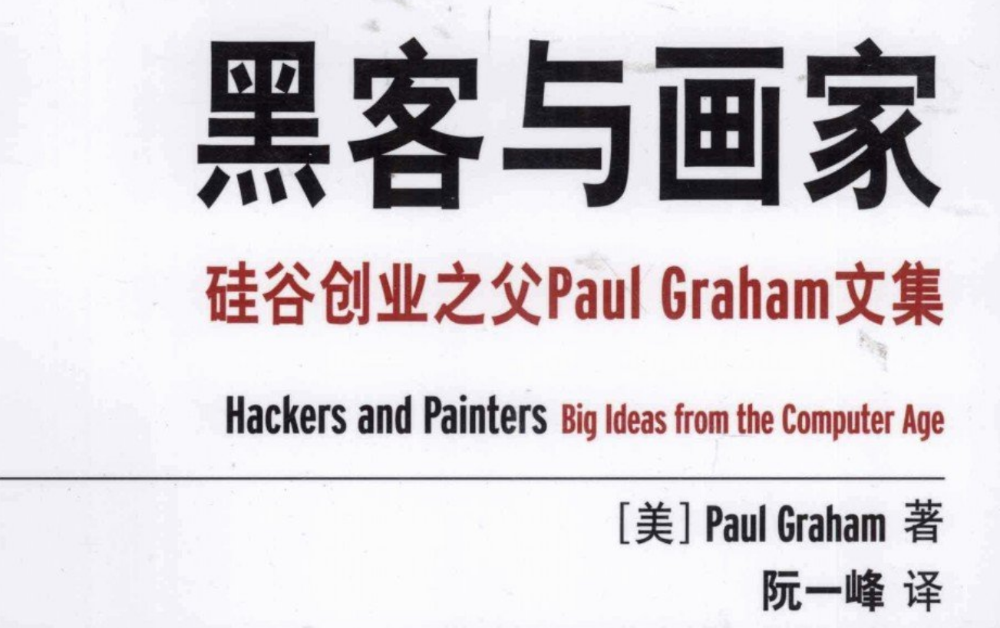
## 6.1  一个命题

## 6.2  运气的成分
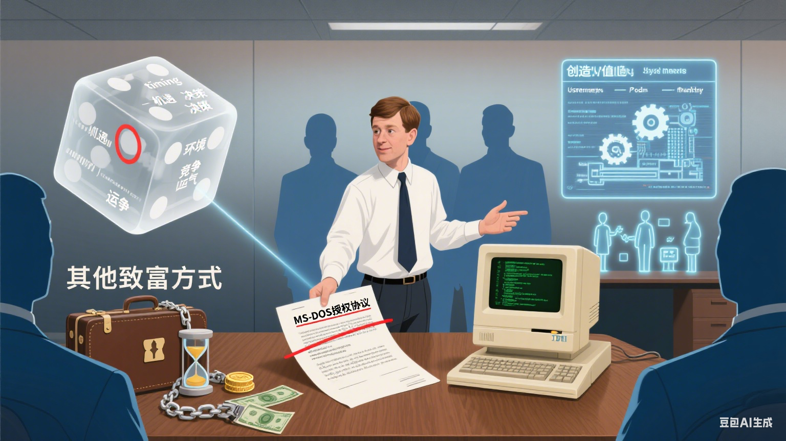
## 6.3  金钱不等于财富
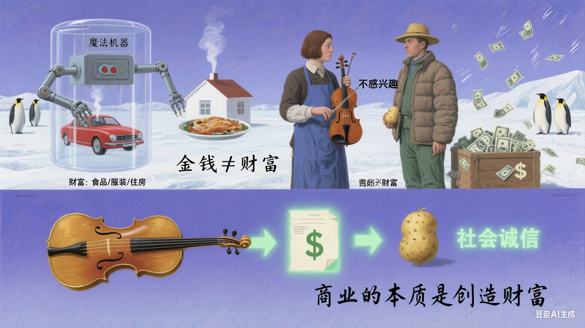
## 6.4  大饼谬论
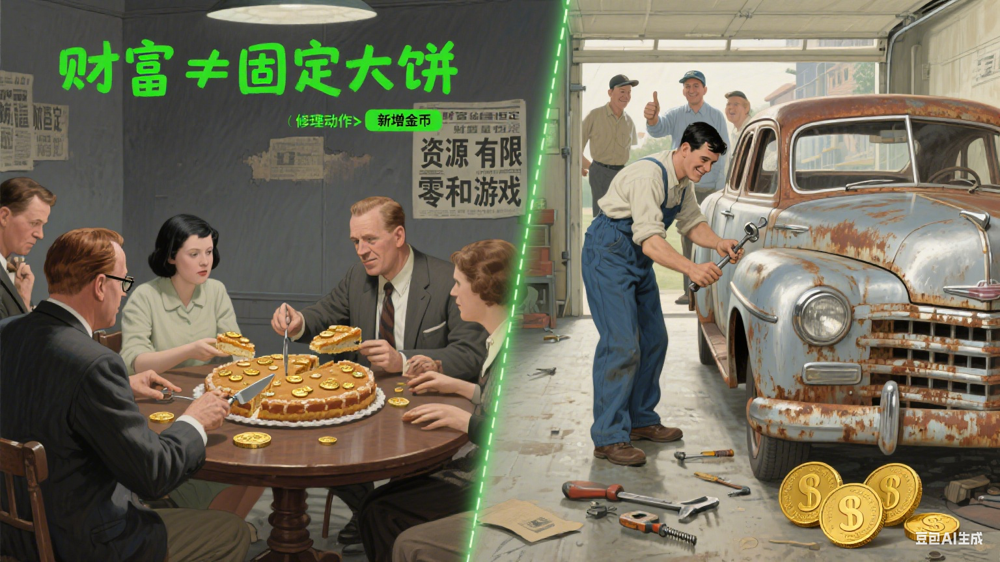
## 6.5  手工艺人

## 6.6  工作是什么
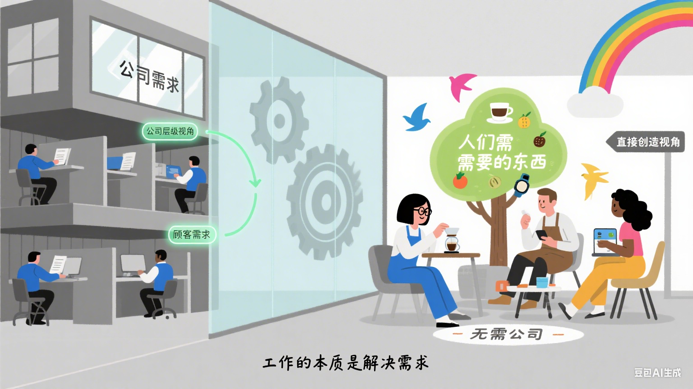
## 6.7  更努力地工作
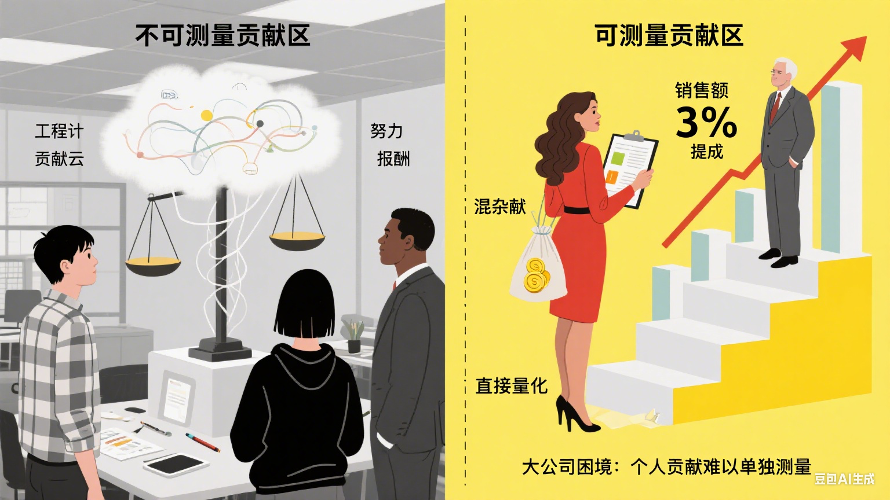
## 6.8  可测量性和可放大 
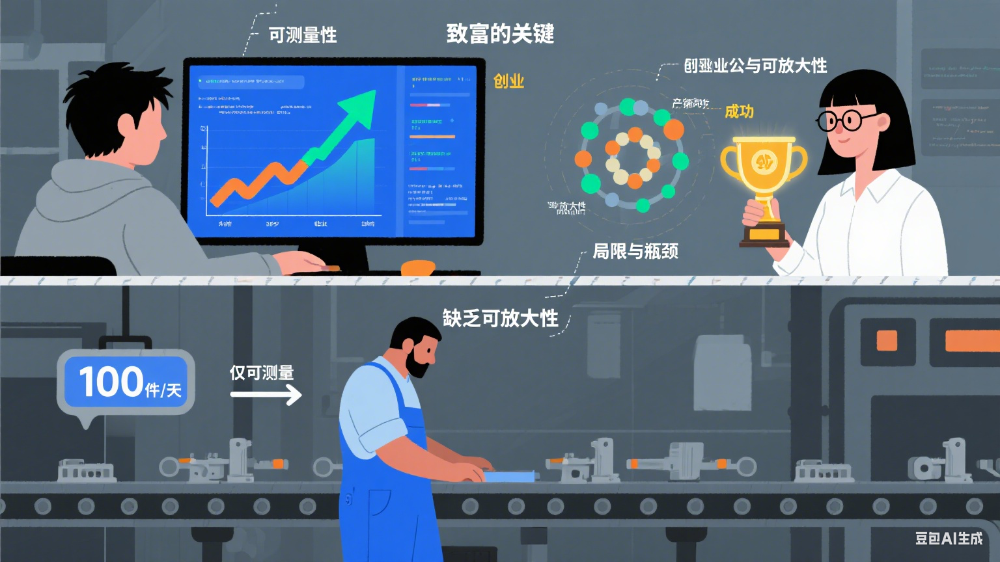
## 6.9  小团体=可测量性
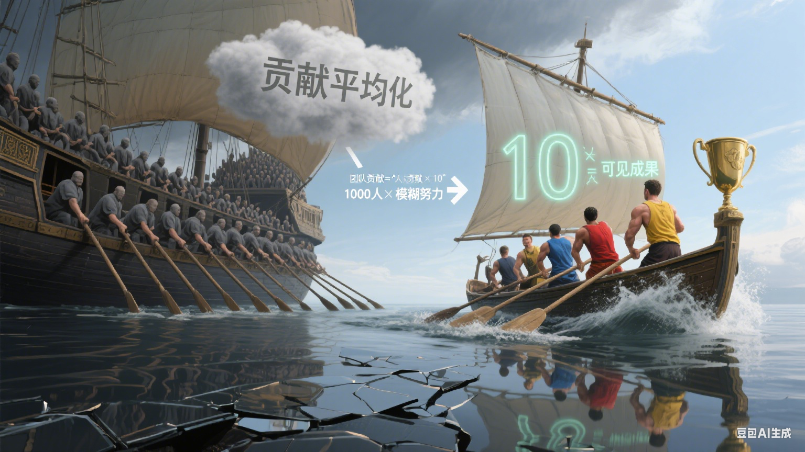
## 6.10 高科技=可放大性
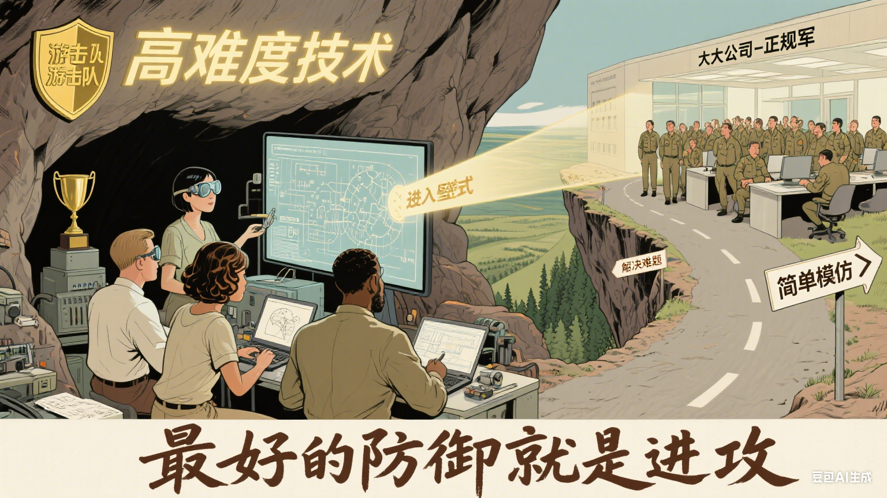
## 6.11 潜规则
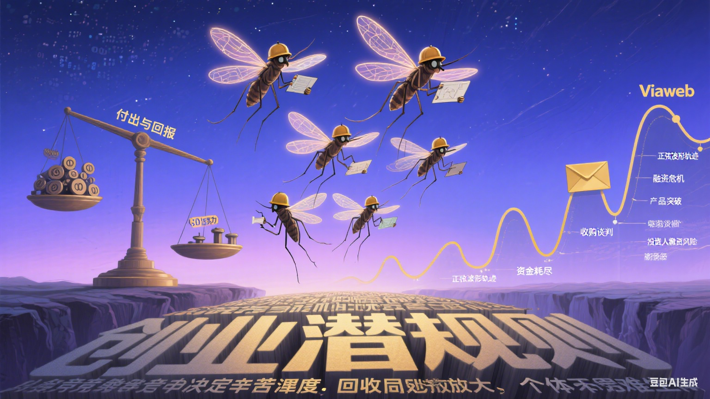
## 6.12 用户数量
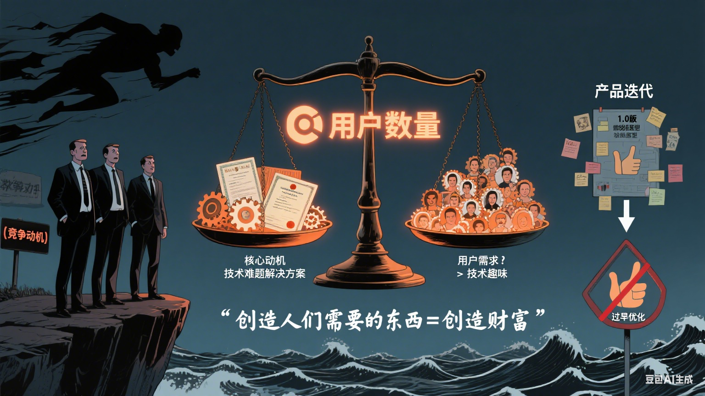
## 6.13 财富和权力
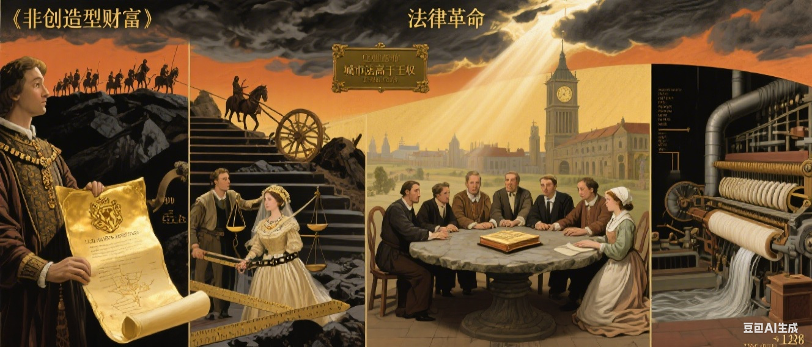
