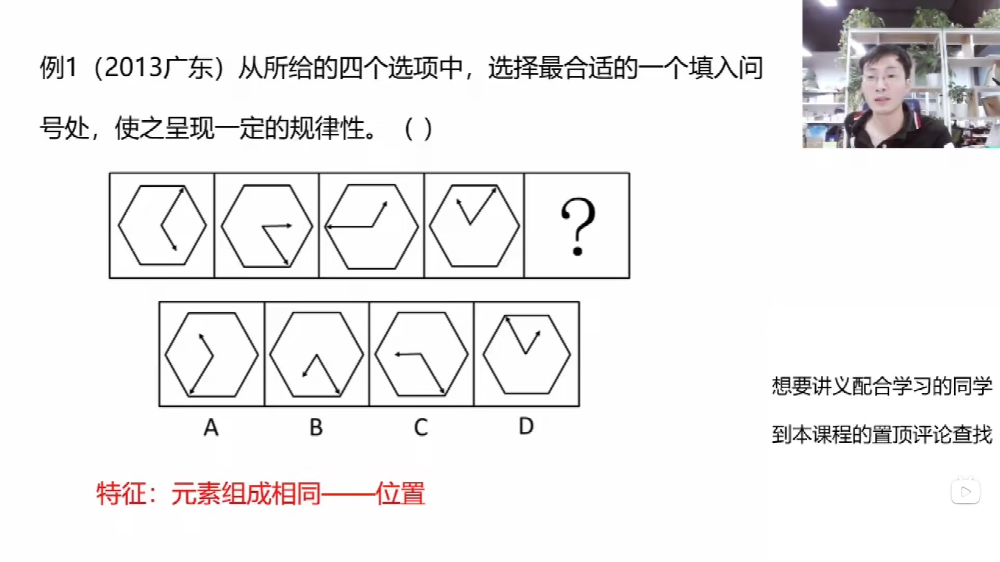
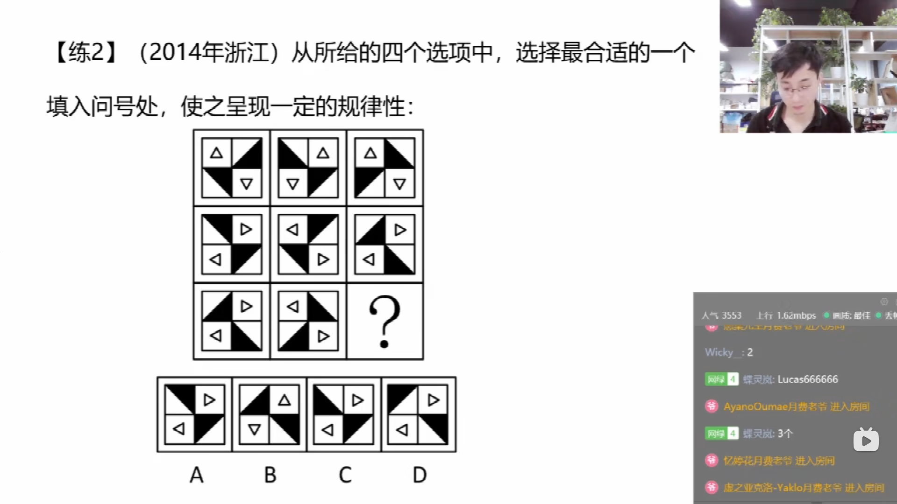

# 判断推理课程链接
<https://www.bilibili.com/video/BV12t4115735/>  
# 第一节 图形推理 位置规律
## 判断推理的分值  
```txt
    国考 40/130 40/135  
    省考 30/130 35/135  
```
## 判断推理四大题型  
```txt
    1.图形推理  
    2.类比推理  
    3.定义判断  
    4.逻辑推理  
```
## 图形推理的命题方式  
```txt
    1.一组图  
        6个图像  
            从头到尾找规律(大多数)  
            间隔一个找规律,单数图像和偶数图像(非常少见)  
    2.两组图  
        2个组,每组3个图像  
            前一组图用来找规律,后一组图用来应用规律  
    3.九宫格  
        3个组,每组3个图像  
        90%是横着看  
            看第一行找规律  
            看第二行验证规律  
            看第三行应用规律  
        10%可能是竖着看(每一列)  
            也可以是米字形来看  
            也可以是S形来看  
    4.分组分类  
        6个图形,分成2组,每一组3个图像  
    5.空间重构  
        展开图和立体图形之间的关系/三视图/截面图  
```
## 图形推理的考点  
```txt
    1.位置规律  
    2.样式规律  
    3.属性规律  
    4.数量规律  
    5.特殊规律  
    6.空间重构  
    7.立体图形  
```
## 图形推理的难点  
```txt
    如何快速定位到某一图形的考点  
        主要看图形特征  
```
## 位置类识别特征  
```txt
    元素组成相同  
```
## 考点
```txt
    1.平移
    2.旋转、翻转
```
### 考点一 平移
```txt
    1.方向:直线(上下/左右/斜对角线)/绕圈(顺逆时针)
    2.常见步数:恒定/递增/递减(等差)

```
### 考题
  
  
  
  
  
  
  
  
  
  
  
  
  
### 考点二 旋转/翻转
```txt
    1.旋转
        (1)方向:顺时针/逆时针
        (2)常见角度:45度/90度/180度/15度
    2.翻转
        (1)左右翻转:竖轴对称
        (2)上下翻转:横轴对称
```
### 考题
  
  
  
  
  
  
  
  
  
## 思维导图
  
