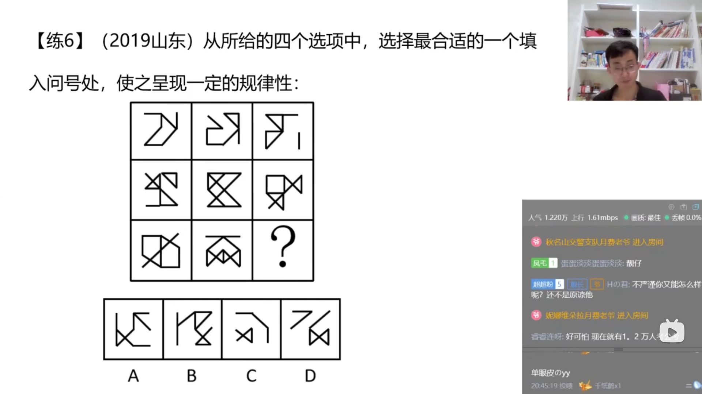

# 第二节 图形推理 样式规律
## 识别特征
```txt
    识别特征:元素组成相似
        相似:指的是一组图形的线条重复出现
```
  
## 考点一:加减同异
```txt
    1.相加/相减
    2.求异(去同求异)
        原理类似于消消乐,把前两幅图中重复出现的线条消去
    3.求同(去异求同)
```
  
### 考题
  
  
  
  
  
  
  
  
  
  
  
  
  
## 考点二:黑白运算
```txt
    1.特征:图形轮廓和分隔区域相同,内部的颜色不同
    2.方法:相同位置运算
    区分:
        黑块数量相同:优先平移
        黑块位置不同:优先黑白运算
    黑白运算:
        黑块和白块之间进行的一种逻辑运算
```
  
### 考题
  
  
  
  
  
## 思维导图
  
