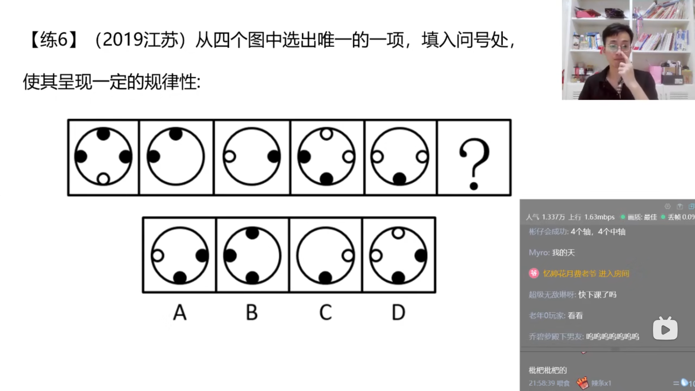

# 第三节 图形推理 属性规律
## 识别特征
```txt
    属性类识别特征:
        元素组成不相同/不相似
        优先元素
    考点:
        1.对称性
        2.曲直性
        3.开闭性
```
  
## 考点一:对称性
```txt
    1.轴对称(方向和数量)
    2.中心对称
        中心对称图形:
            在平面内,把一个图形绕着某个点旋转180度,
            如果旋转后的图形能与原来的图形重合,
            那么这个图形叫做中心对称图形,
            这个点叫做它的对称中心.
```
  
  
### 考题
  
  
  
  
  
  
  
  
  
  
  
  
  
  
  
  
  
## 考点二:曲直性
```txt
    1.全曲线
    2.全直线
```
  
### 考题
  
  
  
  
  
  
## 考点三:开闭性
```txt
    1.全封闭
    2.全开放
    特征:完整的图形留了小开口,可以考虑开闭性
```
  
  
  
## 思维导图
  
