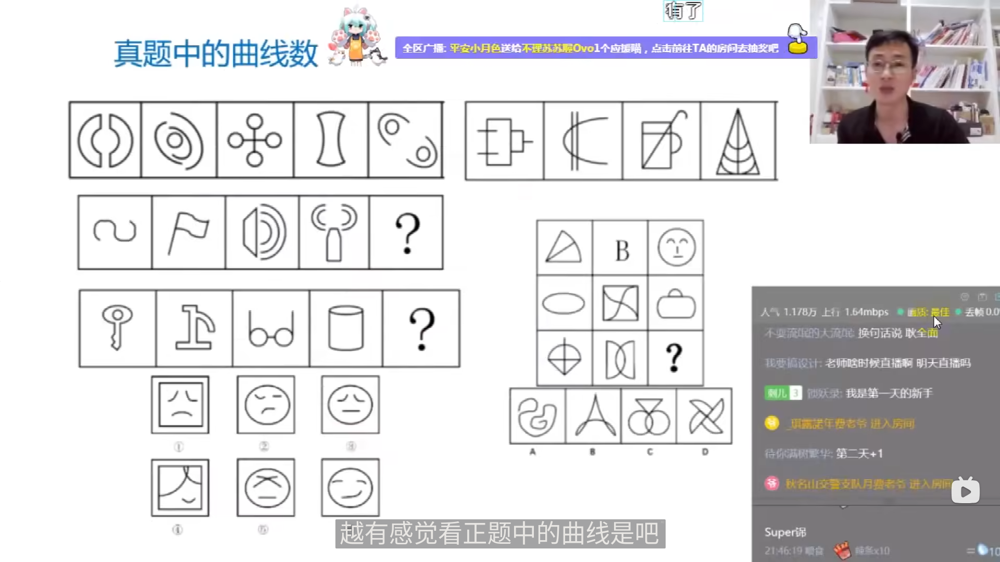
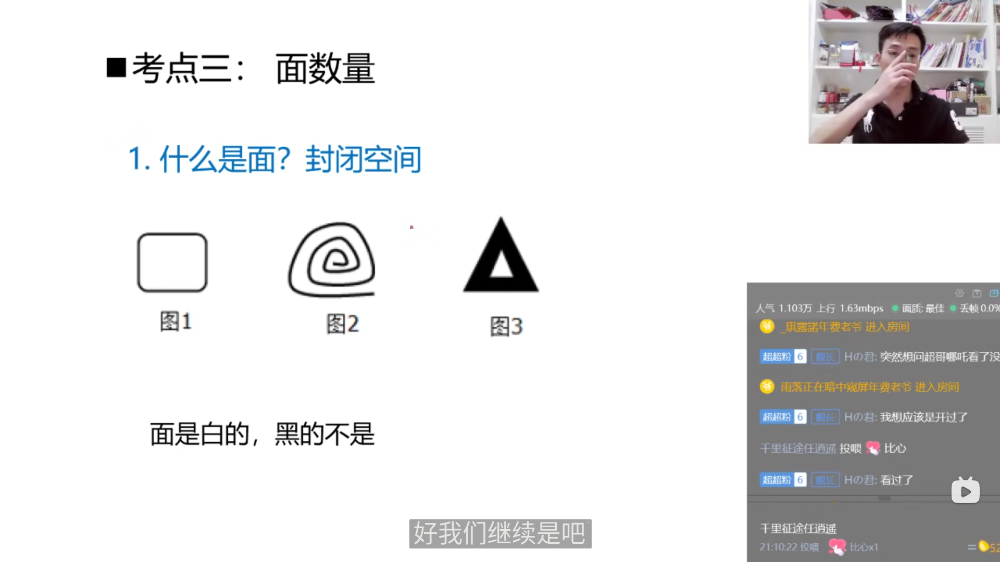
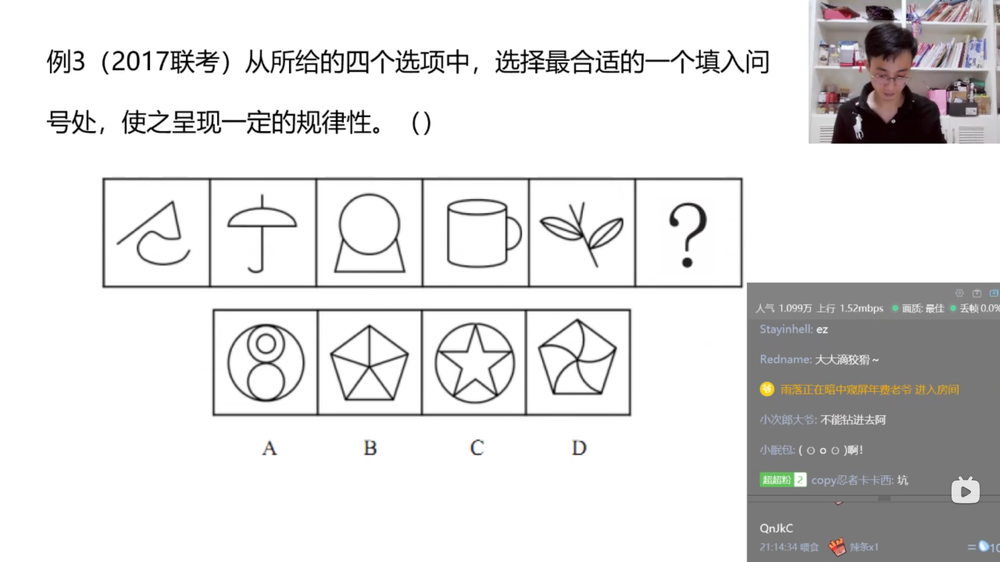
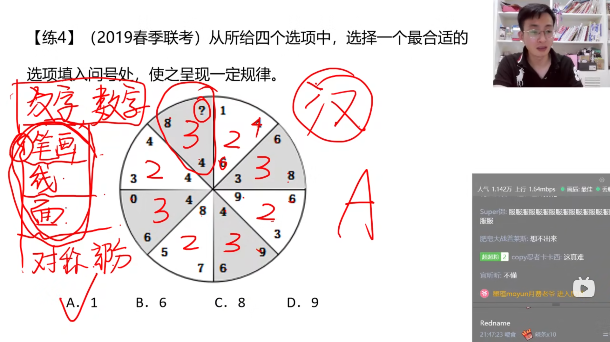
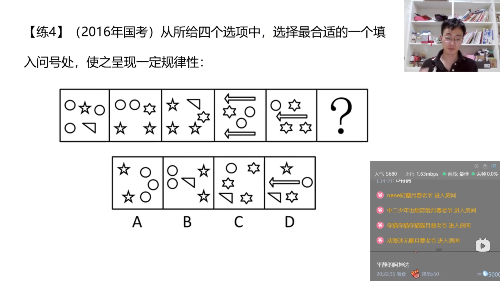
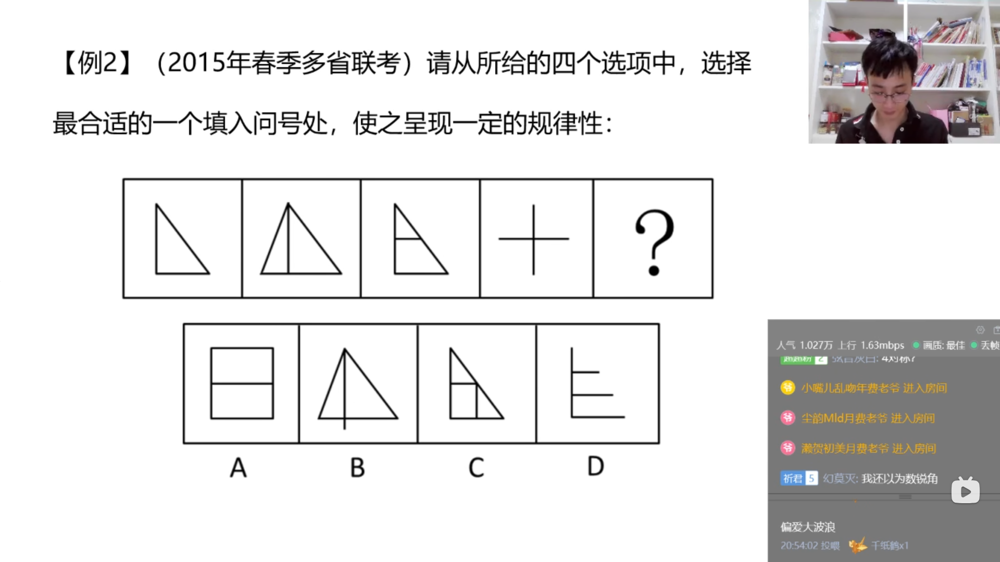

# 第四节 图形推理 数量规律
## 识别特征
```txt
    数量类识别特征
        元素组成不相同/不相似
        数量规律明显
    考点
        点/线/面/素/角
```
  
## 考点一:点数量
```txt
    线与线的交点
        注意:切点(线与线相切)也是交点
        1.直线与直线的交点
        2.直线与曲线的交点
        3.曲线与曲线的交点
        3.无交点
```
  
  
### 考题
  
  
  
  
  
  
## 考点二:线数量
```txt
    直线数特征图:多边形/单一直线
    曲线数特征图:曲线图形(全曲线图/圆/弧)
        曲线:指的是一条平滑的曲线,没有折点
        例子:数字8是一条曲线还是两条曲线?
        答案是一条曲线
```
  
  
  
### 考题
  
  
  
  
  
  
  
  
  
  
  
  
  
### 难题答案
  
  
  
  
  
### 特殊考点
```txt
    线的特殊考点:笔画问题
        一笔画:图形由一笔画成,线条不能重复来回画
        一笔画问题的判断依据:
            1.线条之间连通
            2.奇点数=0或2
            奇点:由一个点发射出奇数条线
            问题:一条线的端点是不是奇点?
            答案:是奇点
        多笔画问题:
            笔画数=奇点数/2(奇点数一定是偶数个)
            对于不连通的图形一定要每一个部分分开去数,然后将笔画数量相加
```
  
  
  
  
  
  
  
#### 考题
  
  
  
  
  
  
  
  
  
### 考点二思维导图
  
## 考点三:面数量
```txt
    1.什么是面?封闭空间
        面是白的,黑的不是
    2.什么时候数面?
        (1)图形被分割/封闭面明显
        (2)生活化图形/粗线条图形中留空白区域
```
  
  
### 考题
  
  
  
  
  
  
  
  
  
  
  
  
  
  
  
### 难题答案
  
  
  
  
  
  
  
  
  
## 考点四:素数量
```txt
    小元素特征:
        1.元素种类
        2.元素个数
        3.元素替换
    特征:多个独立小图形
```
  
### 考题
  
  
  
  
  
  
  
  
  
  
### 难题答案
  
  
  
  
  
### 部分数特征
```txt
    部分数特征
        这里的部分是指的一个图形可以由几个黑色的部分组成.
    特征:生活化图形、黑色粗线条图形
```
  
#### 考题
  
  
  
  
### 生活化、黑线条常见考法
```txt
    1.部分数
    2.面(黑线条内部留白较多)
    3.属性(对称、开闭)
```
  
#### 考题
  
  
## 考点五:角数量
```txt
    角:内角,即0度到180度之间的角
        锐角、直角、钝角
    题型特征:扇形图、改造图、折线图
```
  
### 考题
  
  
  
### 难题答案
  
  
## 思维导图
  
