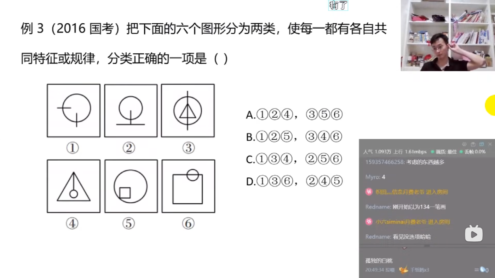

# 第四节 图形推理 数量规律
## 识别特征
```txt
    数量类识别特征
        元素组成不相同/不相似
        数量规律明显
    考点
        点/线/面/素/角
```
  
## 考点一:点数量
```txt
    线与线的交点
        注意:切点(线与线相切)也是交点
        1.直线与直线的交点
        2.直线与曲线的交点
        3.曲线与曲线的交点
        3.无交点
```
  
  
### 考题
  
  
  
  
  
  
