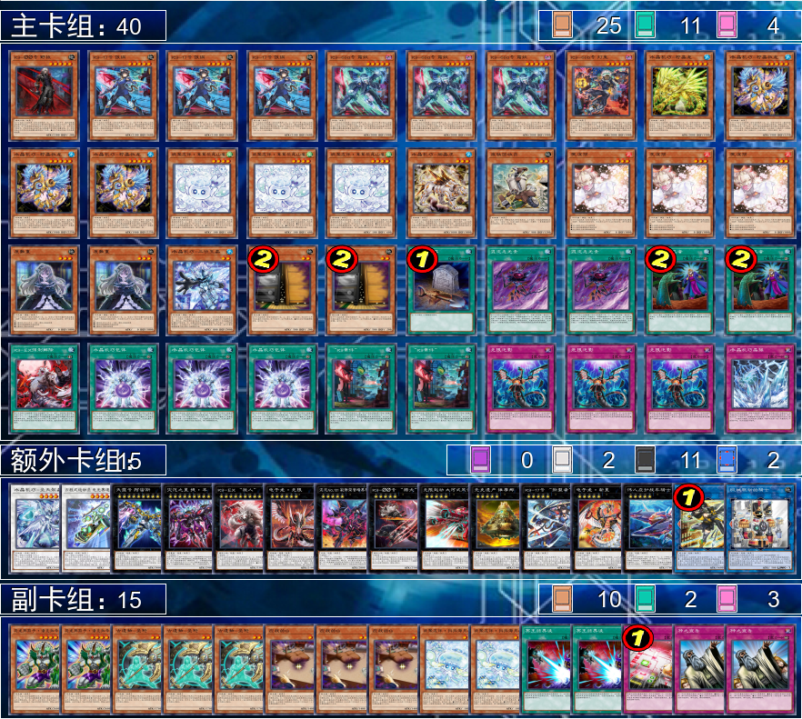

# 【202504】K9水机 卡组教程
# 卡组  
  
# 换备  
## 对哈基米  
### 我方先攻  
出3鸟g.  
入1红色重启和2神之宣告.  
### 我方后攻  
出3泡影,1饭纲,2墓穴指名者.  
入2水母,2摔跤,2冥王.  
## 对星辰  
### 我方先攻  
出3鸟g2屋.  
入3应g2神之宣告.  
### 我方后攻  
出3鸟g1晶簇.  
入3应g1红色重启.  
## 对K9水机  
### 我方先攻  
出3鸟g.  
入3圣枪.  
### 我方后攻  
出2墓穴指名2屋.  
入2水母2冥王.  
# COMBO  
## 霜精+救龙  
手牌霜精特殊召唤手牌救龙,
救龙堆卡组虎和包体,
霜精效果检索卡组灯鬼,
霜精+救龙超量大河,
大河去除霜精检索卡组废铁回收员,
手牌灯鬼特殊召唤墓地霜精,
灯鬼效果检索卡组案件,
灯鬼+霜精超量大17,
大17去除灯鬼检索卡组饭纲,
发动案件检索卡组霜精,
通召废铁回收员堆墓卡组柠晶,
废铁回收员link骑士,
骑士+大河link小夜,
墓地虎除外检索卡组包体2,
发动包体2检索卡组晶簇,
墓地柠晶丢弃手牌晶簇特招炸场上案件,
案件效果盖放卡组强制解除,
墓地救龙效果炸场上柠晶特殊召唤,
柠晶遗言效果特殊召唤卡组三位,
三位+救龙同调骸晶,
骸晶回手墓地晶簇,
墓地三位除外炸骸晶,
特招卡组救龙2和救龙3,
骸晶遗言效果特招除外区三位,
救龙2和救龙3叠电子龙新星变无限,
墓地包体除外特殊召唤墓地救龙,
三位+救龙同调方程式,
盖放晶簇.  
此时场上:  
小夜 大17(素材霜精) 无限(素材:救龙2救龙3新星) 方程式 包体  
盖放:强制解除 晶簇  
手牌:饭纲,霜精  
## 霜精+柠晶  
手牌霜精特招手牌柠晶,
霜精效果检索卡组灯鬼,
霜精+柠晶超量大河,
大河去除霜精检索卡组废铁回收员,
手牌灯鬼特招墓地霜精,
灯鬼效果检索卡组案件,
灯鬼+霜精超量大17,
大17去除灯鬼检索卡组饭纲,
发动案件检索卡组霜精,
通召废铁回收员堆墓卡组虎,
废铁回收员link骑士,
骑士+大河link小夜,
墓地虎除外检索卡组包体,
发动包体检索卡组救龙,
墓地柠晶效果丢弃手牌救龙特殊召唤炸场上案件,
案件效果盖放卡组强制解除,
墓地救龙炸场上柠晶特殊召唤,
柠晶遗言效果特殊召唤卡组三位,
救龙堆墓卡组包体2和晶簇,
三位+救龙同调骸晶,
骸晶回手墓地晶簇,
墓地三位除外炸骸晶,
特招卡组救龙2和救龙3,
骸晶遗言效果特招除外区三位,
救龙2和救龙3叠电子龙新星变无限,
墓地包体2除外特殊召唤墓地救龙,
三位+救龙同调方程式,
盖放晶簇.  
此时场上:  
小夜 大17(素材霜精) 无限(素材:救龙2救龙3新星) 方程式 包体  
盖放:强制解除 晶簇  
手牌:饭纲,霜精  
## 包体  
发动包体,
检索卡组救龙,
手牌救龙发效果炸场上包体特殊召唤,
堆墓卡组柠晶和虎,
墓地虎除外检索卡组晶簇,
柠晶丢弃手牌晶簇从墓地特招,
炸自己遗言特招卡组三位,
三位+救龙同调骸晶,
骸晶回手墓地晶簇,
墓地三位除外炸骸晶特招卡组救龙2和救龙3,
骸晶遗言特招除外区三位,
救龙2和救龙3超量新星叠无限,
墓地包体除外特招墓地柠晶/救龙,
柠晶/救龙+三位同调方程式,
盖放晶簇.  
此时场上:  
无限(素材:救龙2救龙3新星) 方程式  
盖放: 晶簇  
未使用本回合的通常召唤机会  
## 愚埋  
发动愚蠢的埋葬,
堆墓卡组虎,
墓地虎除外检索卡组包体,
发动包体,
检索卡组救龙,
手牌救龙炸场上包体特殊召唤,
堆墓卡组晶簇和三位,
墓地包体除外特招墓地三位,
三位+救龙同调骸晶,
骸骨回手墓地晶簇,
墓地三位除外炸骸晶特招卡组救龙2和救龙3,
骸晶遗言特招除外区三位/墓地骸晶,
救龙2和救龙3超量新星叠无限,
盖放晶簇.  
此时场上:  
无限(素材:救龙2救龙3新星) 三位(卡组有一柠晶可用于加速同调方程式)/骸晶  
盖放: 晶簇  
未使用本回合的通常召唤机会  
## 废铁回收员  
通常召唤废铁回收员,
堆墓卡组虎,
墓地虎除外检索卡组包体,
发动包体,
检索卡组救龙,
手牌救龙炸场上包体特殊召唤,
堆墓卡组晶簇和三位,
墓地包体除外特招墓地三位,
三位+救龙同调骸晶,
骸骨回手墓地晶簇,
墓地三位除外炸骸晶特招卡组救龙2和救龙3,
骸晶遗言特招除外区三位/墓地骸晶,
救龙2和救龙3超量新星叠无限,
无限发动效果吸收废铁回收员作为超量素材,
盖放晶簇.  
此时场上:  
无限(素材:废铁回收员救龙2救龙3新星) 三位(卡组有一柠晶可用于加速同调方程式)/骸晶  
盖放: 晶簇  
## 虎  
通常召唤虎,
虎link骑士,
墓地虎除外检索卡组包体,
发动包体,
检索卡组救龙,
手牌救龙炸场上包体特殊召唤,
堆墓卡组晶簇和三位,
墓地包体除外特招墓地三位,
三位+救龙同调骸晶,
骸骨回手墓地晶簇,
墓地三位除外炸骸晶特招卡组救龙2和救龙3,
骸晶遗言特招除外区三位/墓地骸晶,
救龙2和救龙3超量新星叠无限,
无限发动效果吸收骑士作为超量素材,
盖放晶簇.  
此时场上:  
无限(素材:骑士救龙2救龙3新星) 三位(卡组有一柠晶可用于加速同调方程式)/骸晶  
盖放: 晶簇  
## 激活特招效果的饭纲  
手牌饭纲特殊召唤,
堆墓卡组野狼,
墓地野狼特殊召唤,
饭纲+野狼超量大17,
大17去除饭纲(留野狼防泡)检索卡组案件,
盖放强制解除,
发动案件检索卡组灯鬼,
手牌灯鬼特招墓地饭纲,
灯鬼效果检索卡组案件2,
灯鬼+饭纲超量大河,
大河去除灯鬼检索卡组废铁回收员,
通常召唤废铁回收员,
堆墓卡组虎,
废铁回收员link骑士,
骑士解放大河特招墓地废铁回收员,
废铁回收员堆墓卡组柠晶,
骑士+废铁回收员link小夜,
(此时墓地:虎 柠晶),
墓地虎除外检索卡组包体,
发动包体检索卡组晶簇,
墓地柠晶效果丢弃手牌晶簇从墓地特殊召唤炸自己,
柠晶遗言效果特招卡组救龙,
救龙效果堆墓卡组三位和包体2,
墓地包体2除外特招墓地三位,
三位+救龙同调骸晶,
骸晶效果回手墓地晶簇,
墓地三位除外炸骸晶,
特殊召唤卡组救龙2和救龙3,
骸晶遗言效果特招除外区三位,
救龙2和救龙3超量新星叠无限,
墓地救龙发效果炸场上包体特招,
三位+救龙同调方程式,
盖放晶簇.  
此时场上:  
小夜 大17(素材野狼) 无限(素材:救龙2救龙3新星) 方程式  
盖放:强制解除 晶簇  
手牌:案件  
墓地:包体  
## 柠晶+晶簇  
### 路线一  
手牌柠晶丢弃晶簇特殊召唤炸自己,
柠晶遗言效果特招卡组救龙,
救龙效果堆墓卡组虎和包体,
墓地虎除外检索卡组包体2,
发动包体2检索卡组三位,
通常召唤三位,
三位+救龙同调骸晶,
骸晶回手墓地晶簇,
墓地三位除外炸骸晶特招卡组救龙2和救龙3,
骸晶遗言特招除外区三位,
救龙2和救龙3超量新星叠无限,
墓地救龙发效果炸场上包体特招,
三位+救龙同调方程式,
墓地包体除外特殊召唤墓地骸晶,
盖放晶簇.  
此时场上:  
无限(素材:救龙2救龙3新星) 方程式 骸晶  
盖放:晶簇  
墓地:包体  
### 路线二  
手牌柠晶丢弃晶簇特殊召唤炸自己,
柠晶遗言效果特招卡组救龙,
救龙效果堆墓卡组虎和包体,
墓地虎除外检索卡组包体2,
发动包体2检索卡组救龙2,
墓地包体除外特殊召唤墓地柠晶,
柠晶+救龙超量大17,
大17去除救龙发动效果检索卡组案件,
发动案件检索卡组霜精,
手牌霜精发动效果特殊召唤手牌救龙2,
霜精发动效果检索卡组灯鬼,
霜精+救龙2超量大河,
大河去除霜精检索卡组废铁回收员,
手牌灯鬼特殊召唤墓地霜精,
灯鬼检索卡组强制解除,
通常召唤废铁回收员堆墓卡组三位,
废铁回收员link骑士,
骑士解放大河特殊召唤墓地三位,
骑士+霜精link小夜,
三位+灯鬼同调骸晶,
骸晶效果回手墓地晶簇,
墓地救龙发效果炸场上骸晶特殊召唤,
骸晶效果特殊召唤墓地救龙2,
救龙+救龙2超量新星叠无限,
盖放强制解除,
盖放晶簇.  
此时场上:  
小夜 大17(素材:柠晶) 无限 包体  
盖放:强制解除 晶簇  
## 柠晶+救龙  
手牌柠晶丢弃救龙特殊召唤炸自己,
柠晶遗言效果特招卡组虎,
墓地救龙炸场上虎从墓地特殊召唤,
救龙效果堆墓卡组包体和晶簇,
墓地虎除外检索卡组包体2,
发动包体2检索卡组三位,
通常召唤三位,
三位+救龙同调骸晶,
骸晶回手墓地晶簇,
墓地三位除外炸场上骸晶特招卡组救龙2和救龙3,
骸晶遗言效果特殊召唤除外区三位,
救龙2和救龙3超量新星叠无限,
墓地包体除外特殊召唤墓地柠晶/救龙,
三位+柠晶/救龙同调方程式,
盖放晶簇.  
此时场上:  
无限(素材:救龙2救龙3新星) 方程式 包体  
盖放:晶簇  
## 柠晶+三位  
### 路线一
手牌柠晶丢弃三位特殊召唤炸自己,
柠晶遗言效果特招卡组救龙,
救龙效果堆墓卡组包体和虎,
墓地虎除外检索卡组包体2,
发动包体2检索卡组晶簇,
墓地包体除外特殊召唤墓地三位,
三位+救龙同调骸晶,
骸晶回手墓地三位,
通常召唤三位,
墓地救龙炸场上包体2特殊召唤,
三位+救龙同调方程式,
墓地三位除外炸场上骸晶特招卡组救龙2和救龙3,
骸晶遗言效果特殊召唤自己,
救龙2和救龙3超量新星叠无限.
盖放晶簇.  
此时场上:  
无限(素材:救龙2救龙3新星) 方程式 骸晶  
盖放:晶簇  
### 路线二
手牌柠晶丢弃三位特殊召唤炸自己,
柠晶遗言效果特招卡组救龙,
救龙效果堆墓卡组虎和包体,
墓地虎除外检索卡组包体2,
发动包体2检索卡组救龙2,
墓地包体除外特殊召唤墓地柠晶,
柠晶+救龙超量大17,
大17去除救龙发动效果检索卡组案件,
发动案件检索卡组霜精,
手牌霜精发动效果特殊召唤手牌救龙2,
霜精发动效果检索卡组灯鬼,
霜精+救龙超量大河,
大河去除霜精检索卡组废铁回收员,
手牌灯鬼特殊召唤墓地霜精,
灯鬼检索卡组强制解除,
盖放强制解除,
通常召唤废铁回收员,
废铁回收员link骑士,
骑士解放大河特殊召唤墓地三位,
#### 终场变式一
灯鬼+霜精超量战车,
墓地救龙发效果炸场上包体2特殊召唤,
三位+救龙同调方程式.  
此时场上:  
骑士 大17(素材:柠晶) 战车 方程式  
盖放:强制解除  
墓地:包体  
#### 终场变式二
骑士+霜精link小夜,
三位+灯鬼同调骸晶,
骸晶效果回收墓地三位/除外区虎/包体,
墓地救龙发效果炸场上骸晶特殊召唤,
骸晶遗言效果特殊召唤墓地救龙2,
救龙+救龙2超量新星叠无限.  
此时场上:  
小夜 大17(素材:柠晶) 无限 包体  
盖放:强制解除  
手牌:三位/虎/包体
